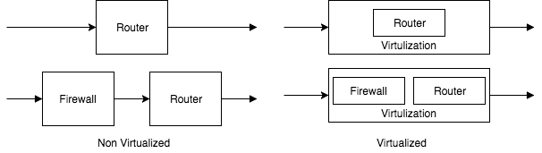
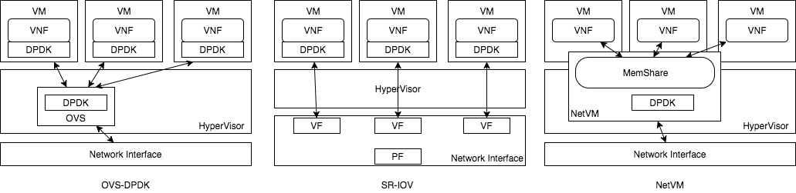
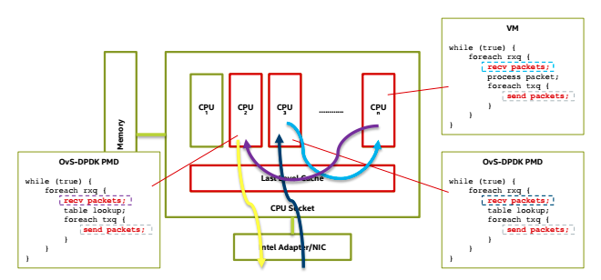

Susanow計画の背景
==================

.. contents:: 目次
  :depth: 2

DPDKの登場
----------

DPDK (Data Plane Development Kit)の登場によりIAサーバを通信に対して最適に
動作させることが可能になった. これまで, Linuxなどの汎用OSに頼った
ネットワークプログラミングでは, カーネルの多大なコンテキストの影響で
IAサーバの持つポテンシャルを十分に発揮できなかったが, DPDKを用いることで独自に
ネットワークOSなどを開発することなく, 100Gクラスのトラフィックを汎用
アーキテクチャのIAサーバで処理することが可能になる.

DPDKは大きく分けて次の4つの特徴がある. これらの特徴により上記のような
IAサーバ通信に飛躍的な成長を遂げた.

- NUMA Awareなメモリ管理機構
- ネットワークスタックをバイパスした独自ドライバ
- CPUのコアアサインメント
- パケット処理に必要なデータ構造とアルゴリズム

DPDKのアーキテクチャを以下に示す.

.. figure:: img/dpdk_arch.png

  DPDK-architecture

DPDKを用いた高性能なVNFとしてKamueeとLagopusなどがある.
Kamuee_ はBGPルータであり, 経路ルックアップにPoptrieというアルゴリズムを用いて,
BGPFullRoute(52万経路)の経路情報で128Byteパケットで145Gbpsを達成した.
Lagopus_ はOpenFlow1.3に対応した高性能なソフトウェアスイッチである.

以下はLagopusのスレッドパターンである.

.. figure:: img/dpdk_vnf.png

  DPDKを採用した高性能VNFのスレッドパターン

DPDKをVM上で使用する
^^^^^^^^^^^^^^^^^^^^

DPDKはVM上でも使用することができる.
この場合VNFをVMイメージとして配布することが可能になり, マイグレーション技術や
スナップショットなどVM技術の利点をネットワーク管理にも利用することができるため,
多くのメリットが存在する. (他にも抽象性などもある)

DPDKをVM上で使用した場合, ベアメタル環境と比べてNICの扱いに違いが生じる.
KVMはでの一般的なネットワーク接続は以下の二種類がある.

- QEMU DeviceEmurationでVMに仮想NICを追加
- PCI passthroughを用いて物理NICを直接VMに追加

どちらの方法もDPDKでNICを制御することは可能だが, 前者のQEMUを用いて仮想NICを
VMに追加する方法の場合, ハイパーバイザとVMでのパケットの受け渡しにオーバヘッド
がある. より具体的に説明すると, VMX non-root/rootの切り替えや,
ハイパーバイザ,VM間でのメモリコピーがとてもコストが高いという問題である.
参考: panda_iw2016_

このような場合ベアメタルのDPDK VNFをKVM上で動作させるだけで大幅な性能低下が
起きてしまう.

.. todo:: 証拠の性証拠の性能比較結果を示す.

.. note::
  VMX non-root/rootの切り替えにはVM Exit/Entry命令を使用するが
  それぞれ約1000サイクルほど必要になってしまう.

  10GbEをショートパケットで処理をする場合, 14Mppsを達成する必要があるが,
  3GHzのCPUを用いた場合, 単純計算でも1パケットに約280サイクルほどで処理を
  行わなくてはいけない. この高コストな処理をパケットごとに行なっている
  わけには行かないのである.

  現状(2017Q3)では,KVM/QEMUの通常の機能で仮想NICを使用する場合,
  仮想NICのバックエンドでvhost-userをを採用することで,
  1コピー転送でVM Entry/Exit呼び出しももっとも少なくすることができる.

SDN/NFVの未来予想図
-------------------

SDN/NFVの登場によりネットワークに様々な価値が追加された.
ここではまず簡単にSDN/NFVについての説明から行なっていき, Susanow計画を始める　
モチベーションとなっている"SDN/NFVの利点と課題"についてフォーカスしていく.

Software Defined Networking (SDN)
^^^^^^^^^^^^^^^^^^^^^^^^^^^^^^^^^

SDNはソフトウェアによりネットワーク制御を行うことで様々な付加価値を
ネットワークに追加する, という考え方である.
これによりネットワークはより動的になり, いたるところに分散している
ネットワーク機器などを集中管理することができるようになる.

Network Functions Virtualization (NFV)
^^^^^^^^^^^^^^^^^^^^^^^^^^^^^^^^^^^^^^

NFVはネットワーク機能を仮想化技術で実現するという考え方である.
汎用のIAサーバの高性能化, 低価格化により仮想化技術が実現可能になり,
これまで高価な専用物理機器を用いていたネットワークアプライアンスも
仮想的(ソフトウェアやVMなど)で実現可能になったことがNFVの背景である.

簡単に言うと以下に示すような利点がある

- CAPEX/OPEXの低減
- 迅速なサービス変形 (Rapid Service Transform)

従来では物理ネットワークアプライアンスを用いて, NF (Network Function: この場合,
ルータやFirewallを示す)を用意していた. これらのNFをデプロイする場合,
現場に物理アプライアンスを用意し, 配線などを個別に行わなくてはいけなかった.
NFVを導入すると, NFはすべてIAサーバ上のソフトウェアで実現するため, 設備に物理
的な作業がなくなる場合が多い. また物理アプライアンスのNFと比べ, 汎用のIAサーバ
はより低価格であり, 設備コストも低下させることが期待できる.

NFVの利点はコストダウンだけではない.
迅速性もNFVのキーワードである. NFを仮想媒体として管理するため, 遠隔地にNFを移動
する場合も従来と比べ, 簡単に行える. NFをVMなどの統一的な形式で保管することで、
移動先との互換性(Compatibility)も高めることができる.
また, Serivce Function Chainingのような動的なNF ChainもNFVによって迅速に
制御可能である.

  Network Functions Virtualization Architecuture

NFVの課題
^^^^^^^^^^^^^^^^^^^^^^^^^^^^^^^^^^^^^^^^^^^^^^

- NFVとVMの関係性
- VM, HV間でのパケット操作にボトルネックあり
- VMオーバヘッド
- DPDKの柔軟性をKVMが吸収する
- VMによるNFVによりパフォーマンス低下
	- VMの性能変更より迅速に性能を変更したい
	- VMオーバヘッドは考えていない
- 様々な情報は色々なタイミングで決定する
	- 企画次に決まる情報
	- デプロイ次に決まる情報
	- 実行中に決まる情報
- 高度に仮想化がすすみつつある現代ではHSPCRを実装しただけではだめ
- それを利用するフィールドの整備まで行わなければならない

Service Function Chaining (SFC)
^^^^^^^^^^^^^^^^^^^^^^^^^^^^^^^

SFCとはサービス機能に合わせて, NFを適切に数珠つなぎにする技術
Function Chain(数珠つなぎにしたNF達)をNFV/SDNで制御することで迅速に
サービスを拡大/縮小が実現可能になる. (ex. Router → Router+IDS)

.. figure:: img/sfc.png

  Service Function Chaining Architecuture

IETFやETSIではSFCを標準化するために多数の議論を行っている.
(ex. NSH,Network Service Header: SFC Chaing designのためのプロトコル)
日本での近況事例としては, SFCはInteropで2017も導入され目玉機能として
デモンストレーションを行われた.

現状のSFCの実現方法(ソフトウェアスタックレベル, not Protocol level)としては
以下のようなパターンがある.

- OvS-dpdk
- BESS
- SR-IOV
- NetVM
- Susanow

  SFCの構成例

関連するOSS
^^^^^^^^^^^^^

OpenDaylight

- not only OpenFlow Controller
- Supports: BGP, OpenFlow, NETCONF
- Controllerとしては世界でもっとも知名度が高い?
- 商用サポートあり

Open vSwitch (OvS)

- OpenFlow vSwitch developed as OSS
- Linuxのbridgeと互換性あり
- DPDK利用可能

OvS-DPDK

- パケット処理をDPDKによってアクセラレーション
- VM上, HV上の両方でDPDKを使うことが高性能化の条件
- ただ使うだけでなく, VMの仮装NICの種類によって性能が変化する

- OVS用にいくつかのCPUを使用する
- {sum of vCPU} > {num of cores}になったら, vm\_entry, vm\_exitの数が上昇?
- DPDKのCPUpinningの効果が低減
- VM上で動くVNFが一般的なDPDK VNFならまとめて管理をできる

高性能パケット処理
------------------

- 小さいパケットほどbpsを稼ぐのが難しい.
- ethernetの最小パケットサイズは64Byte

.. code-block:: none

  64Byte 10GbE
  64byteと仮定すると 10Gbps == 14Mpps
  CPU動作周波数を3GHzとすると
  3G clk === 1sec == 14M packet
  14M packet === 3G clk
  1 packet === 214 clk === 71ns

Short Packet時
- 10GbE: 71ns
- 40GbE: 17ns
- 100GbE: 7.1ns !!!

VM Entry/Exit はそれぞれCorei7-6700Kで約1000サイクルかかる [1]
RAMのコピ-はどれくらい?: [TBD]

並列/並行処理
^^^^^^^^^^^^^^^^^^^^^^^^^^^^^^^^^^^^^^^^^^^^

この二つは似ていて違う
- 並列: 複数の動作を同時に出来るなら、並列(parallel)
- 並行: 実行状態を複数保てるなら、並行(concurrent)

x86の並列並行処理はいくつかある

- HyperThreading (どっちだ..)
- pthread (カーネル空間で切り替えるスレッド)
- lthread (DPDK API, ユーザ空間で切り替えるスレッド)

マルチタスクのための切り替えにも種類がある

- 協調的Multi Tasking (pre-enptive multi task) pthreadはこれ
- 非協調的Multi Tasking (non-pre-enptive multi task) lthreadはこれ

.. todo:: これらのベンチマークは?

まとめ
------

.. todo:: 背景についてまとめる

References
----------
- Kamuee_
- Lagopus_
- panda_iw2016_

.. _Kamuee: https://www.nic.ad.jp/ja/materials/iw/2016/proceedings/t03/t3-ohara.pdf
.. _Lagopus: http://www.lagopus.org/
.. _panda_iw2016: https://www.nic.ad.jp/ja/materials/iw/2016/proceedings/t03/t3-asai.pdf

