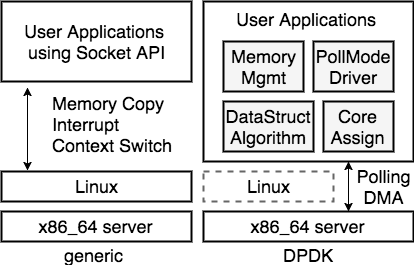
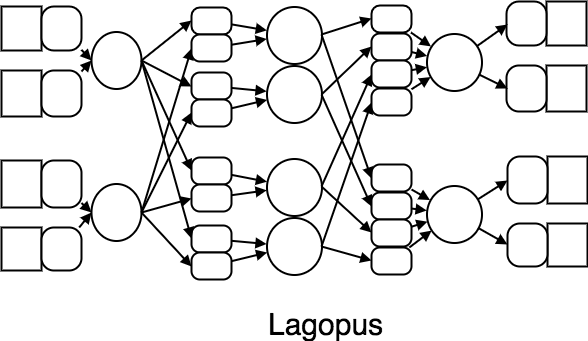
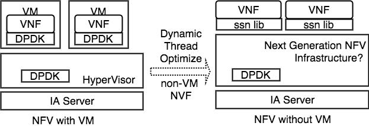

計画の背景
==================

.. contents:: 目次
  :depth: 3

DPDKの登場
----------

DPDK (Data Plane Development Kit)の登場によりIAサーバを通信に対して最適に
動作させることが可能になった. これまで, Linuxなどの汎用OSに頼った
ネットワークプログラミングでは, カーネルの多大なコンテキストの影響で
IAサーバの持つポテンシャルを十分に発揮できなかったが, DPDKを用いることで独自に
ネットワークOSなどを開発することなく, 100Gクラスのトラフィックを汎用の
IAサーバで処理することが可能になる.

DPDKのアーキテクチャを以下に示す.

  DPDK-architecture

DPDKは大きく分けて次の4つの特徴がある. これらの特徴により上記のような
IAサーバ通信に飛躍的な成長を遂げた.

- NUMA Awareなメモリ管理機構
- ネットワークスタックをバイパスした独自ドライバ
- CPUのコアアサインメント
- パケット処理に必要なデータ構造とアルゴリズム

DPDKを用いた高性能なVNFとしてKamueeとLagopusなどがある.
Kamuee_ はBGPルータであり, 経路ルックアップにPoptrieというアルゴリズムを用いて,
BGPFullRoute(52万経路)の経路情報で128Byteパケットで145Gbpsを達成した.
Lagopus_ はOpenFlow1.3に対応した高性能なソフトウェアスイッチである.

以下はLagopusのスレッドパターンである.

  DPDKを採用した高性能VNFのスレッドパターン

上記の図の丸がコア, 四角がNICのRx/Tx(左がRx,右がTx), 角が丸められた四角は
ロックフリーなキューである.
このように, DPDKでは複数存在するCPUのコアをパケット処理に対してオプティマルに
配置することで高性能通信を実現することができる.

.. _vmdpdk:

DPDKをVM上で使用する
^^^^^^^^^^^^^^^^^^^^

DPDKはVM上でも使用することができる.
この場合VNFをVMイメージとして配布することが可能になり, マイグレーション技術や
スナップショットなどVM技術の利点をネットワーク管理にも利用することができるため,
多くのメリットが存在する. (他にも抽象性などいくつかの利点ある)

DPDKをVM上で使用した場合, ベアメタル環境と比べてNICの扱いに違いが生じる.
KVMはでの一般的なネットワーク接続は以下の二種類がある.

- QEMU DeviceEmurationでVMに仮想NICを追加
- PCI passthroughを用いて物理NICを直接VMに追加

どちらの方法もDPDKでNICを制御することは可能だが, 前者のQEMUを用いて仮想NICを
VMに追加する方法の場合, ハイパーバイザとVMでのパケットの受け渡しにオーバヘッド
がある. より具体的に説明すると, VMX non-root/rootの切り替えや,
ハイパーバイザ,VM間でのメモリコピーがとてもコストが高いという問題である.
参考: panda_iw2016_

このような場合ベアメタルのDPDK VNFをKVM上で動作させるだけで大幅な性能低下が
起きてしまう. 以下の図はDPDKをVMで用いた場合でのボトルネックを示している.

.. figure:: img/vm_overhead.png

  DPDKをVM上で使用した場合でのボトルネック

.. todo:: 証拠の性証拠の性能比較結果を示す.

.. note::
  VMX non-root/rootの切り替えにはVM Exit/Entry命令を使用するが
  それぞれ約1000サイクルほど必要になってしまう.

  10GbEをショートパケットで処理をする場合, 14Mppsを達成する必要があるが,
  3GHzのCPUを用いた場合, 単純計算でも1パケットに約280サイクルほどで処理を
  行わなくてはいけない. この高コストな処理をパケットごとに行なっている
  わけには行かないのである.

  現状(2017Q3)では,KVM/QEMUの通常の機能で仮想NICを使用する場合,
  仮想NICのバックエンドでvhost-userをを採用することで,
  1コピー転送でVM Entry/Exit呼び出しももっとも少なくすることができる.

SDN/NFVの未来予想図
-------------------

SDN/NFVの登場によりネットワークに様々な価値が追加された.
ここではまず簡単にSDN/NFVについての説明から行なっていき, Susanow計画を始める　
モチベーションとなっている"SDN/NFVの利点と課題"についてフォーカスしていく.

Software Defined Networking (SDN)
^^^^^^^^^^^^^^^^^^^^^^^^^^^^^^^^^

SDNはソフトウェアによりネットワーク制御を行うことで様々な付加価値を
ネットワークに追加する, という考え方である.
これによりネットワークはより動的になり, いたるところに分散している
ネットワーク機器などを集中管理することができるようになる.

Network Functions Virtualization (NFV)
^^^^^^^^^^^^^^^^^^^^^^^^^^^^^^^^^^^^^^

NFVはネットワーク機能を仮想化技術で実現するという考え方である.
汎用のIAサーバの高性能化, 低価格化により仮想化技術が実現可能になり,
これまで高価な専用物理機器を用いていたネットワークアプライアンスも
仮想的(ソフトウェアやVMなど)で実現可能になったことがNFVの背景である.

NVFは以下に示すような利点がある.

- CAPEX/OPEXの低減
- 迅速なサービス変形 (Rapid Service Transform)

従来では物理ネットワークアプライアンスを用いて, NF (Network Function: この場合,
ルータやFirewallを示す)を用意していた. これらのNFをデプロイする場合,
現場に物理アプライアンスを用意し, 配線などを個別に行わなくてはいけなかった.
NFVを導入すると, NFはすべてIAサーバ上のソフトウェアで実現するため, 設備に物理
的な作業がなくなる場合が多い. また物理アプライアンスのNFと比べ, 汎用のIAサーバ
はより低価格であり, 設備コストも低下させることが期待できる.

NFVの利点はコストダウンだけではない.
迅速性もNFVのキーワードである. NFを仮想媒体として管理するため, 遠隔地にNFを移動
する場合も従来と比べ, 簡単に行える. NFをVMなどの統一的な形式で保管することで,
移動先との互換性(Compatibility)も高めることができる.
また, Serivce Function Chainingのような動的なNF ChainもNFVによって迅速に
制御可能である.

.. figure:: img/nfv.png

  Network Functions Virtualization Architecuture

Service Function Chaining (SFC)
^^^^^^^^^^^^^^^^^^^^^^^^^^^^^^^

SFCとはサービス機能に合わせて, NFを適切に数珠つなぎにする技術
Function Chain(数珠つなぎにしたNF達)をNFV/SDNで制御することで迅速に
サービスを拡大/縮小が実現可能になる. (ex. Router → Router+IDS)

.. figure:: img/sfc.png

  Service Function Chaining Architecuture

IETFやETSIではSFCを標準化するために多数の議論を行っている.
(ex. NSH,Network Service Header: SFC Chaing designのためのプロトコル)
日本での近況事例としては, SFCはInteropで2017も導入され目玉機能として
デモンストレーションを行われた.

この時,同一ホスト上にあるVNF通しを接続する方法が幾つか存在する.
OvS_ を用いる方法や, NICのHW支援機構であるSR-IOVを用いる方法など
様々である. 研究分野ではVMどうしで共有メモリを用いることでパケットを
ゼロコピーで渡しあう構造を提案する NetVM_ なども存在する.
以下のその構造を示した図を示す.

.. figure:: img/vm_sfc.png

  SFCの構成例

高度に動的なネットワーク制御
^^^^^^^^^^^^^^^^^^^^^^^^^^^^

.. todo:: ここを書く
  具体的には瞬間セキュリティ強度などでネットワーク構成を変更したり
  利用者の増加に合わせてサービスをサービスをスケールさせたりする
  話をしたい.
  結論として, 秒や分単位での動的スケールは結構難しいことが示したい.

NFVの課題
^^^^^^^^^

NFVは今後のネットワーク技術をより豊かにしていく可能性が高いが,
以下に示すような幾つかの課題を抱えており, これがNFVの導入困難性を招いている.

- 性能の問題
- 信頼性の問題

多くのNFVの実装方式はVNFをVM単位で用意することで,互換性などを高くしている.
しかしVMを用いてNFを実装することで性能面での低下が落ちてしまっている.
VNFを高性能に実装したい場合, DPDKのような独自のパケット処理機構を用いること
が多いが, この場合, :ref:`vmdpdk` に示したような仮装NICによる
性能低下が発生する. ハイパーバイザ側に複数存在するコアリソースをVMに振り分けて
おくと, 最適にVMに対してコアリソースを振り分けない場合, 一部のVMが
ボトルネックになり, 性能低下が引き起こる場合がある.

重要なネットワークに対してNFVを導入できない原因として信頼性がまだ高くはない
という現状がある. 世の中にはDPDKを用いた(もしくは用いていない)高機能なVNFは
多数存在するが, それらの全てがミッションクリティカルな環境に導入できるかは
まだ検討が必要な段階である. またオープンコミュニティで開発されている必要もある.
(導入事例増やし, 多くの人間で問題監視を行うという点で. 参考: Linux's Law)
現状で商用サポートをし, 安定性が見込めるソフトウェアルータや
ソフトウェアFirewallは世の中にまだ多くはない.
我々は高性能なVNFを開発するだけでなく, その知見や問題を論文やカンファレンス,
OSSにすることなどで世の中全体で進めていかなくてはいけない.

まとめ
------

ここまでの内容をまとめると以下のようになる.

- DPDKにより高性能通信が可能になった
- DPDKをVM上で動かす場合, ベアメタル環境と比べて現状性能低下が大きくある
- 柔軟性を保ちつつそれを解決する場合, 仮装NICを再実装する必要がある
- SDN/NFVにより高度に動的で柔軟なNW制御が可能になる
- NFVは性能,信頼性などまだ実現には課題がある
- DPDKを用いたVNFの開発によりNFVの性能面を解決可能である

ここまでがこれまでのSusanow計画の背景となる事実であり,現時点ではNFVの実現には
以下のような課題がある.

- NFVの高度な動的性により構造は複雑になる
- DPDK VNFの開発コストが高い
- マルチコアモデルに最適に実装する必要
- チューニングなどでリコーディングが必要になることもある

本計画では以下に示すようなことを行い, SDN/NFVの課題を解決し,
高性能NFVの実現を試みる.

- DPDKのチューニングの一部としてスレッドのチューニングがある
- DPDK VNFはNICのマルチキューやスレッドの多重化でスケールできる
- DPDK VNFの性能チューニングの一部をNFV基盤で自動に行う
- VMを用いず特別な薄いレイヤを用意し, そこに直接NFをデプロイする
- 一度書いたVNFをあらゆるグレードのネットワークに適用可能に
  することでリコーディングを防ぐ
- 書くVNFの開発を促進させ, VNFの信頼性を向上させる作業が加速
- 高性能なNFVの実現が可能になる

  Susanow計画

References
----------
- Kamuee_
- Lagopus_
- panda_iw2016_
- OvS_
- NetVM_

.. _Kamuee: https://www.nic.ad.jp/ja/materials/iw/2016/proceedings/t03/t3-ohara.pdf
.. _Lagopus: http://www.lagopus.org/
.. _panda_iw2016: https://www.nic.ad.jp/ja/materials/iw/2016/proceedings/t03/t3-asai.pdf
.. _OvS: http://openvswitch.org/
.. _NetVM: https://www.usenix.org/node/179740

