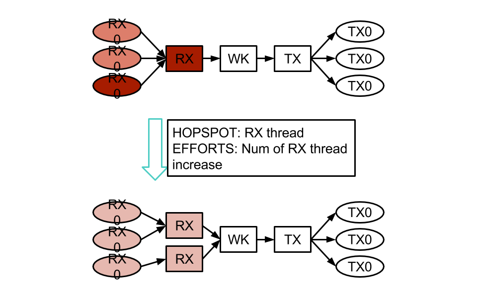
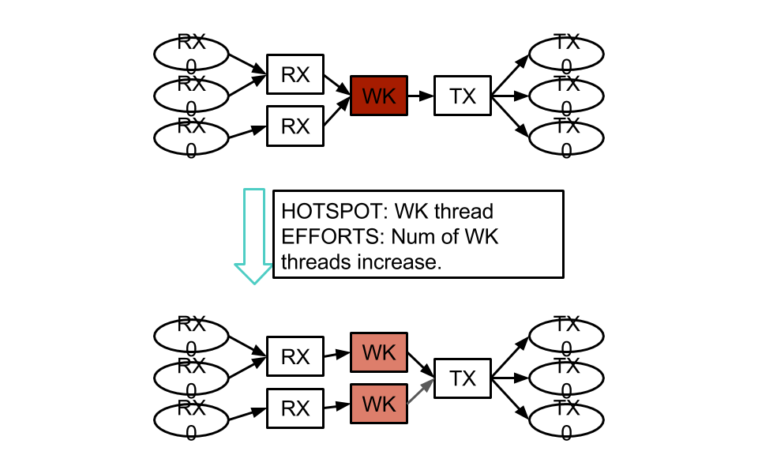

Dynamic Re CPU Pinning (DRCP)
=============================

Dynamic Re CPU Pinning is the most important feature of Susanow.
It optimizes the pattern of CPU Pinning themselves, while runnning.

For example, system uses very simple CPU pinning pattern like below.

Memo
^^^^

 - Hotspot is moved by traffic pattern.
 - Reseach on Tuning Algorithm
 - It it possible to separate the specification that user
   want to implement and the high performance
 - This idea and Manycore are good chemistry

