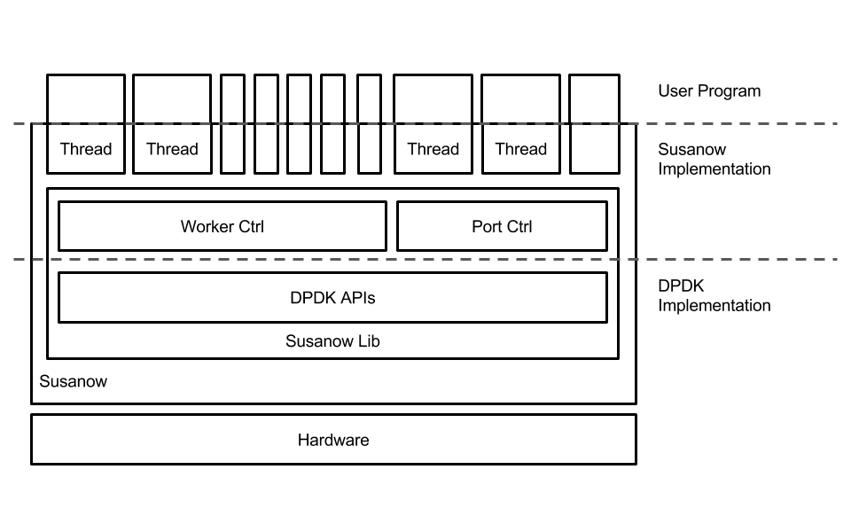
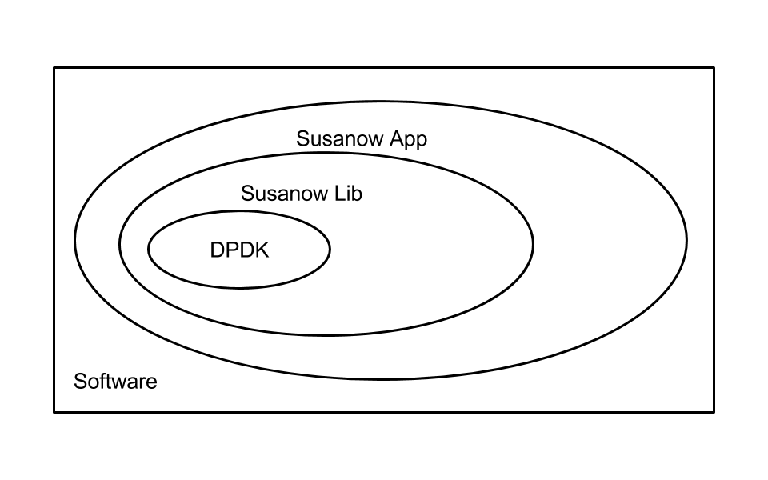

Implementation
==============

Rules
^^^^^
Susanow is designed to following as below-rules

 - Auto Optimization CPU Pinning
 - Use SmartPtr to implement Polimorfizm
 - Implement like a Library-OS
 - Hate implicit prototypes
 - Move semantics is better than reference and pointer
 - Avalable to change Design Structure
 - Using full-power of C++11
 - Avalable to Re-Configuration while runnning
 - All of needed Modules to implement Router,Switch.. are included
 - Susanow calc Benchmark themselves
 - Use iterator to loop syntax fastly
 - don't use [] operator, use .at().

The [] operator doesn't throw exception if specific range error index.
The .at() function throw exception if that, but it is a little slow.
User have to use .at() when random accsess and iterator when fast iteration.

To write efficient code easily, Susanow is conposed as following.

.. image:: ./img/threadpattern.png

libsusanow wraps dpdk APIs to add interfaces as following

 - throw exception
 - constructor/destructor
 - hide some interface that independent parameters
   and usually set as default value

Susanow is one of simple example using libsusanow.
It using simple template susanow interface, ex Port_interface class,
Ring_interface class Txq_interace class and Rxq_interface class.
All of each interface class has simple virtual function to process
their purposes.  So basic Susanow can only simple processes.
If user want Susanow to work more complex process,
they can implement new interface class that
inherit exist interface class. Detiled information as functiones and
classes sepecification includes API documentation from Doxygen.
We develop api documentation and Susanow platform at the same time.
APIs documentation will help you.

Goal
^^^^^
 - Efficientry Code to implement Router, Switch and more
 - Easy to scale increase number of cores
 - Running on Linux/x64
 - It can try to new algorithms
 - Next generation HPN platform

Memos
^^^^^^
 - Many type of Graphs representing thread patters
 - Susanow includes simple thread implementation
   user can extend these
 - Simple Software Conponents

Contribution
^^^^^^^^^^^^^

If you want to more detiled one, please see the issues and milestone
on Github https://github.com/susanow/susanow

If you have some ideas or opinions to enhance our system,
please access us on twitter, github, facebook or E-mail.
You can access us from the following information.

 - twitter @slankdev
 - github  slankdev
 - facebokk hirokishirokura
 - email slank.dev@gmail.com

if you are little compassionate, please tell us that you saw our GithubPages.
because there are many emails (most of spam) coming mu emailbox.

