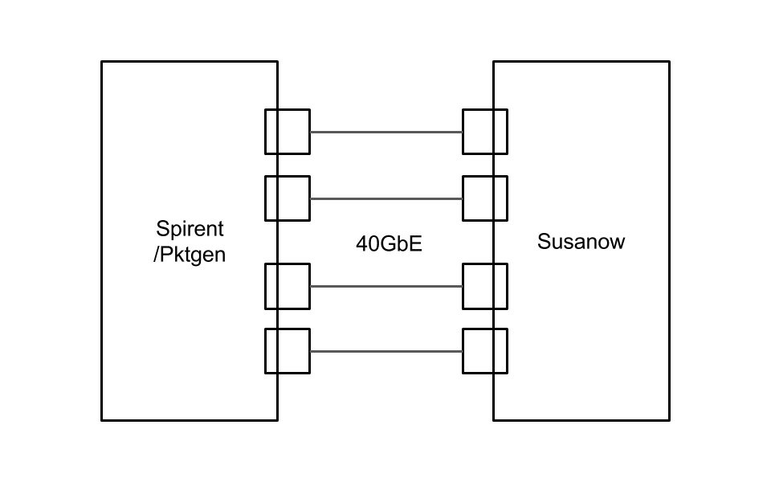

.. Susanow documentation master file, created by
   sphinx-quickstart on Fri Oct 13 12:33:10 2017.
   You can adapt this file completely to your liking, but it should at least
   contain the root `toctree` directive.

SusanowVNF性能レポート
===================================

Benchmark
^^^^^^^^^^^

 - CPU Test
     - using null_pmd. calc CPU limit
 - Traffic Test
     - using Traffic-Generator to calc Ovserver Value
     - Traffic-generator
        - Pktegen-DPDK
        - Spirent
 - Envs (not tested)
     - PC/WS (Core i7, Xeon E5, Xeon Phi)
     - Tester Pktgen-DPDK, Spirent

Environment
^^^^^^^^^^^

System Spec: Pattern1
^^^^^^^^^^^^^^^^^^^^^^^

 - Tester
    - CPU: Intel Core i7-3930K @ 3.8GHz x12core
    - RAM: 32GB
    - NIC: Intel X540 T2
    - OS: Ubuntu 16.04 Xenial
    - Soft: pktgen with DPDK-16.07
 - DUT
    - CPU: Intel Core i7-3770 @ 3.9GHz x8core
    - RAM: 16GB
    - NIC: Intel X540 T2
    - OS: Ubuntu 16.04 Xenial
    - Soft: Susanow with DPDK-16.07

pktgen runnning Environment

 - num of lcores for rx0: 7
 - num of lcores for rx1: 7
 - num of lcores for tx0/tx1: 1
 - packet size: 128Byte
 - burst size : 32
 - commandline
    - option -m "[1-7:11].[0:0], [8-10:11].[1:1]"
 - runtime
    - set all size 128
    - set all burst 32

Eveluation Point
^^^^^^^^^^^^^^^^

 - throughput
 - latency
 - jitter
 - power consumption

