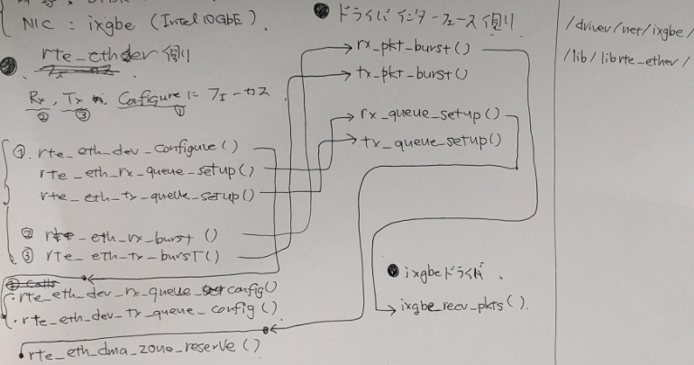

# DPDK 10GbE-NIC デバイスドライバ調査

- 2017.10.11
- Hiroki SHIROKURA (slank.dev [at] gmail.com)
- 対象
	- DPDK v17.05
	- IXGBE (Intel 10GbE)

どこかでブログにできたらいいなあと思うが,
今は乗り気でないので, ここに雑記として残す.

現段階は勉強段階の調査であるため, 本資料には間違いがある可能性がある.
御意見は私(@slankdev, slank.dev[at]gmail.com)までお願いしたい.

## 概要

NICのドライバがどのように書かれて, どのような経路を辿って呼び出されているかを
確認することを目的とする. 今後vhost-userの仕組みを理解する時に物理NICに対する
アクセス方法を知っていると良いと思ったため調べることにした.

**作業内容**
- DPDKで必要不可欠な関数の中を探り,ドライバの関数が呼び出されるところまでたどる
- どのようにRingバッファなどを操作するのか, データ構造を図示する

**参照したファイルと関数**
```
- dpdk/lib/librte\_ether/以下
	- rte_eth_dev_configure()
	- rte_eth_rx_queue_setup()
	- rte_eth_tx_queue_setup()
	- rte_eth_rx_burst()
	- rte_eth_tx_burst()
	- rte_eth_dev_rx_queue_config()
	- rte_eth_dev_tx_queue_config()
- dpdk/driver/net/ixgbe/以下
	- ixgbe_recv_pkts()
	- ixgbe_dev_rx_init()
- その他
	- rte_eth_dma_zone_reserve()
	- rte_mem_phy2mch()
```

**読むときに参考にしたブログ記事など**
- https://syuu1228.github.io/howto_implement_hypervisor/part15.html#fn1
- https://raphine.wordpress.com/kernel/code_reading/driver/pcie/
- http://raphine.hatenablog.com/entry/2017/09/25/041641
- http://raphine.hatenablog.com/entry/2017/01/11/000000
- http://seminar-materials.iijlab.net/iijlab-seminar/iijlab-seminar-20150409-0.pdf
- https://www.nic.ad.jp/ja/materials/iw/2016/proceedings/t03/t3-asai.pdf

## 関数について説明 [TBD: Memoを示す]



## データ構造の図示 [TBD: Memoを示す]

参考資料では下図のようなものをよく見る.


上記のような抽象的なデータ構造をDPDKでは以下のようなデータ構造で管理している.


