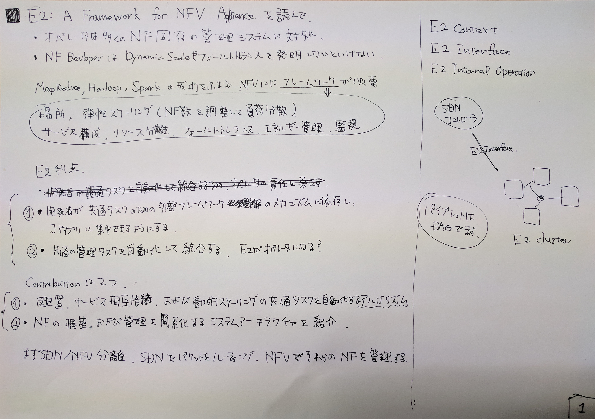
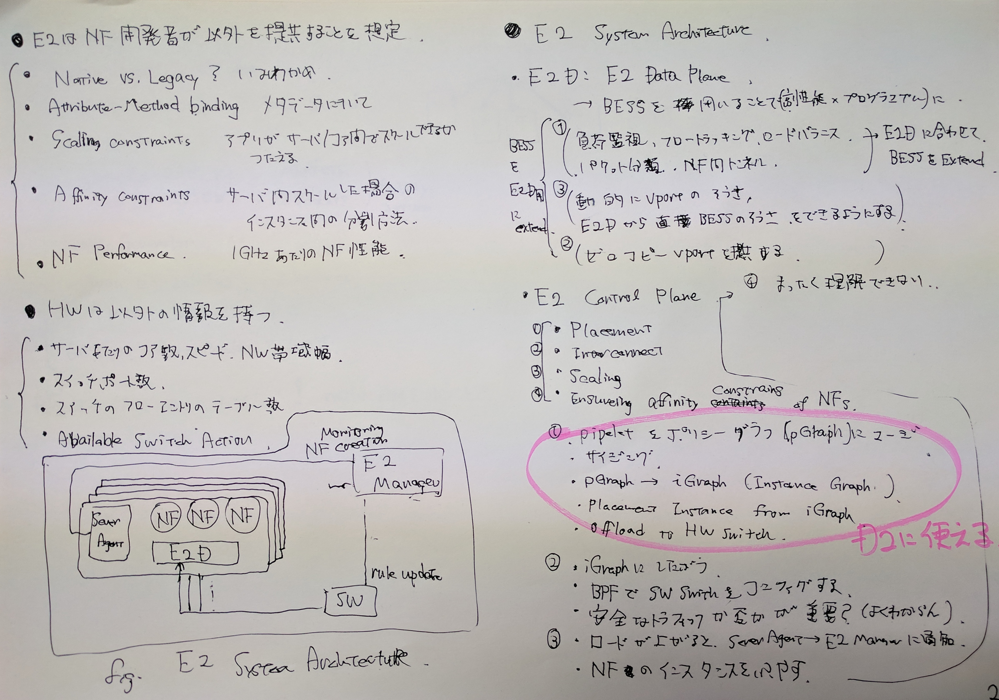
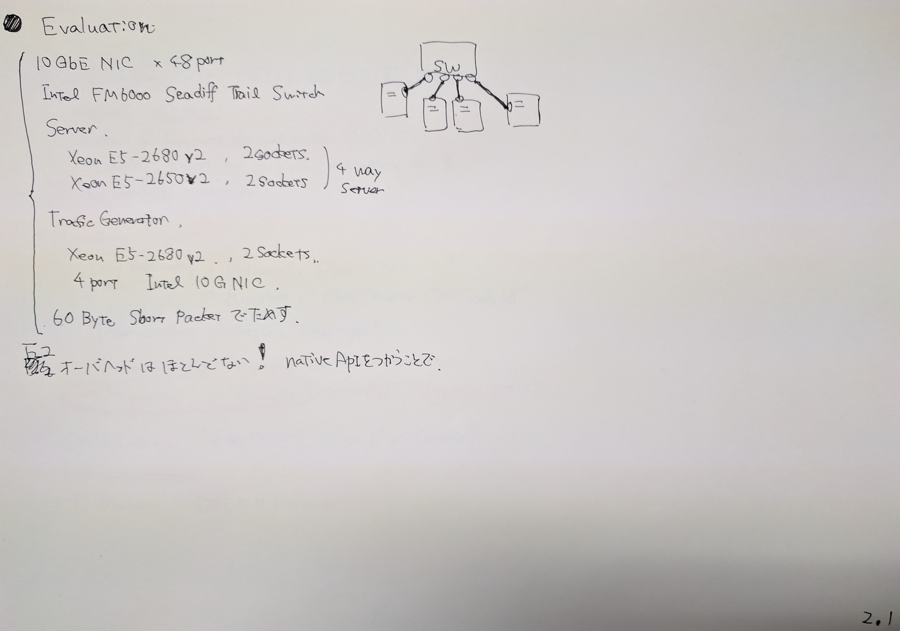
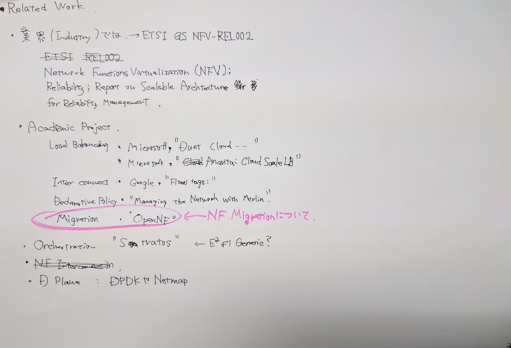

E2: A Framework for NFV Applications
=====================================

- カンファレンス: USENIX SOSP'15
- 研究者: UCB, Intel, UofPisa
- 報告者: Hiroki SHIROKURA (slank.dev[at]gmail.com)
- 最終更新: 2017.10.26

Notes
-----

References
----------

- ACM_DIGITAL_LIVRALY_

.. References
.. _ACM_DIGITAL_LIVRALY: https://dl.acm.org/citation.cfm?id=2815423

