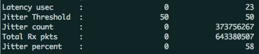

# [WIP] Pipeline 段数による性能の変化測定



##  Traffic Generator/Analyzer

```
# sudo ./app/x86_64-native-linuxapp-gcc/pktgen \
	-- \
	-P \
	-m "[1-4].0-1"
```
```
> enable all latency
> set all size 96   # latecy計測は96以上でないと計測されない
> start 0
> stop 0
```

## 注意点

本計測は有意な情報を取得できていない可能性が高い.
それは計測環境のコンピュータ資源が足りていないためであると思われる.
その結果として, ショートパケット時のbaseline値で帯域が安定せず
wirerateが出なかった.

## ベンチマーク結果

```
size            0096   0128   0256   0512   1024
--------------------------------------------------
BaseLine[Mbps]  8125   9972   9984   9985   9994
BaseLine[usec]   407     58     11     15     23
```


