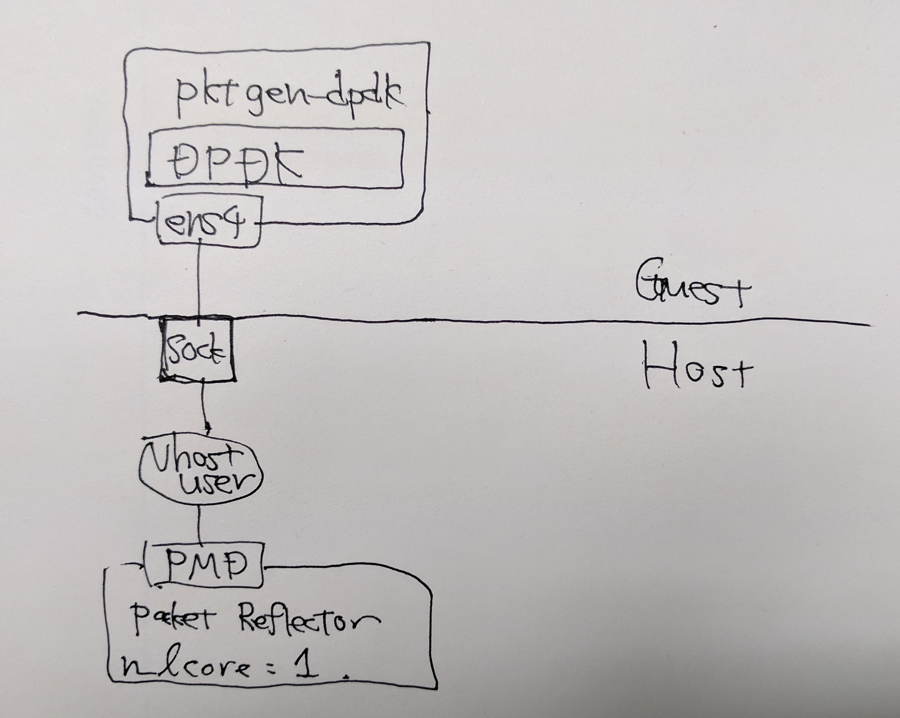
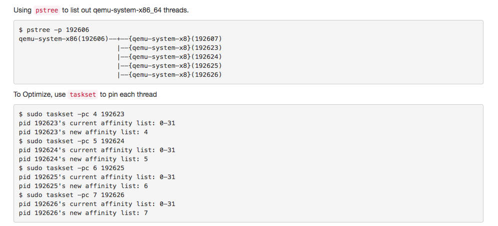

# [WIP] vHost User 性能計測

- Hiroki SHIROKURA (slank.dev[at]gmail.com)
- 2017.10.17

vhost-userの動作確認も含めての検証なので, まだ性格な情報は取れていない.

## 測定のデザイン

以下を固定条件とする
- ホスト2ゲストでのパケット折り返し性能計測
- VM側: pktgen-dpdk
- HV側: vhost-userを用いた自作vSW (パケットリフレクター)
- vcpupinをして論理コアを占有
	- ホストのlcore数は8 (4-physical-core with HT)
	- ホスト用: 0x0f
	- ゲスト用: 0xf0
	- numactlを用いてvcpupin
- NUMAは考慮しない (smpのみ)

変化させるパラメータ
- uio-module: ``uio_pci_generic``, ``dpdk/igb_uio.ko``
- num of multi queues:
	- ``uio_pci_generic``: 1 (multi que非対応)
	- ``dpdk/igb_uio.ko``: 1, 2
- packet-size: 64, 128, 256, 512, 1024

性能計測時の接続環境を以下に示す.




## isolcpusについて

DPDKは通常``rte_eal_init()``を行ったタイミングでlcore0以外のCPUの所有権を
全てさらっていると思われる. (要検証,今回はそうだと仮定する)
DPDKの性能計測に関しての論文でもisolcpuを使った場合と使わない場合で
性能の変化がないとの報告があった. [5]

ちなみに,isolcpusを指定した時, host側のユーザプロセスがisolateした
CPUに対して貼り付けられなくなった.(以下のコマンドで再現可能)

```
CPUS=0-7
CMDLINE="isolcpus=4-7"
$ numactl --physcpubind=4-7 stress -c 2 //動くがコアを2つ使おうとしない, 1つのコアのみで動く
```

上記のコマンドは今回使用していない

## VMに特定のCPUを全てわたす方法について(numactl問題)

VM起動コマンドを``numactl``経由で行い, VMのvCPUを貼り付けているのだが,
範囲指定は可能だが, vm's lcoreN binds to host's lcoreMができない.

```
[HV] # numactl --physcpubind=4-7 qemu-kvm ...
[HV] # htop  // ここで監視
[VM] # numactl --physcpubind=0 stress -c 1  (a)
[VM] # numactl --physcpubind=1 stress -c 1  (b)
[VM] # numactl --physcpubind=2 stress -c 1  (c)
[VM] # numactl --physcpubind=3 stress -c 1  (d)
```

これらのプロセスがhost側では偏って動く.
(a), (b)がHost側で同じコアで動くことがある. 現在対処策として
libvirt経由で起動するとそのような場合をなんとかできそうだが,
どうしてもqemu側から使いたい.

**追記**: <br>


## 性能計測に用いた設定, プログラム

vSW source-code
```
#include <stdio.h>
#include <dpdk/dpdk.h>
#include <slankdev/string.h>
#include <slankdev/exception.h>
using slankdev::exception;
using slankdev::format;
constexpr size_t nq = 1; // parameter
constexpr size_t nb_rxqueues = nq;
constexpr size_t nb_txqueues = nq;

int packet_capture(void*)
{
  const size_t n_port = rte_eth_dev_count();
  while (true) {
    for (size_t pid=0; pid<n_port; pid++) {
      for (size_t qid=0; qid<nb_rxqueues; qid++) {
        constexpr size_t BURSTSZ = 32;
        rte_mbuf* mbufs[BURSTSZ];

        size_t nb_recv = rte_eth_rx_burst(pid, qid, mbufs, BURSTSZ);
        if (nb_recv == 0) continue;
        rte_eth_tx_burst(pid, qid, mbufs, nb_recv);
      }
    }
  } /* while (true) */
}

int main(int argc, char** argv)
{
  dpdk::dpdk_boot(argc, argv);
  size_t n_port = rte_eth_dev_count();
  printf("%zd ports found \n", n_port);
  if (n_port != 1)
    throw exception(format("n_port isn't 1(%zd)", n_port));

  struct rte_mempool* mp = dpdk::mp_alloc("RXMBUFMP");
  struct rte_eth_conf port_conf;
  dpdk::init_portconf(&port_conf);
  port_conf.rxmode.mq_mode = ETH_MQ_RX_RSS;
  port_conf.rx_adv_conf.rss_conf.rss_key = NULL;
  port_conf.rx_adv_conf.rss_conf.rss_hf = ETH_RSS_IP|ETH_RSS_TCP|ETH_RSS_UDP;
  for (size_t i=0; i<n_port; i++) {
    dpdk::port_configure(i, nb_rxqueues, nb_txqueues, &port_conf, mp);
  }

  dpdk::rte_eal_remote_launch(packet_capture, nullptr, 2);
  rte_eal_mp_wait_lcore();
}
```

vSW makefile
```
LIBSLANKDEV = $(HOME)/git/libslankdev
LIB = $(HOME)/git/libdpdk_cpp
include $(LIB)/mk/dpdk.cpp.mk

CXXFLAGS += -I$(LIBSLANKDEV)
CXXFLAGS += -I$(LIB) $(DPDK_CXXFLAGS) -std=c++11 -Wno-format-security -O0
LDFLAGS  = $(DPDK_LDFLAGS)

all:
	$(CXX) $(CXXFLAGS) main.cc $(LDFLAGS)

SOCK=/tmp/sock0
run:
	sudo rm -f $(SOCK)
	sudo ./a.out  --vdev=net_vhost0,iface=$(SOCK),queues=1
```

VM's pktgen-dpdk config
```
$ sudo ./pktgen \
        -- \
        -P \
        -m "[1].[0]"

$ sudo ./pktgen \
        -- \
        -P \
        -m "[1-2].[0]"

> set all size 64
> start 0
> stop 0
> set all size 128
> start 0
> stop 0
```

VM-start-script
```
#!/bin/sh

QEMU=qemu-system-x86_64
HDAPATH=/home/slank/qemu/u1604.qcow2
SOCKPATH=/tmp/sock0
HPPATH=/mnt/huge_kvm

numactl --physcpubind=4-7 $QEMU \
	-enable-kvm -cpu host -smp 4 \
	-hda $HDAPATH \
	\
	-m 512 \
	-object memory-backend-file,id=mem,size=512M,mem-path=$HPPATH,share=on \
	-numa node,memdev=mem -m 512 -mem-prealloc \
	\
	-boot c -vnc :0,password \
	-monitor stdio \
	\
	-net nic,model=virtio,macaddr=52:54:00:11:11:11 \
	-net tap,script=/etc/qemu-ifup \
	\
	-chardev socket,id=char1,path=$SOCKPATH \
	-netdev type=vhost-user,id=net1,chardev=char1,vhostforce,queues=1 \
	-device virtio-net-pci,mac=02:cd:c6:a0:01:01,netdev=net1

	# n_queue=2's config
	# -netdev type=vhost-user,id=net1,chardev=char1,vhostforce,queues=2 \
	# -device virtio-net-pci,mac=02:cd:c6:a0:01:01,netdev=net1,mq=on,vectors=6

	# n_queue=4's config
	# -netdev type=vhost-user,id=net1,chardev=char1,vhostforce,queues=4 \
	# -device virtio-net-pci,mac=02:cd:c6:a0:01:01,netdev=net1,mq=on,vectors=10
```

## 性能計測結果

```
module          queueus      0064      0128      0256      0512      1024
-------------------------------------------------------------------------------
uio_pci_generic 1Q(1 lcores) 8040/8040 9121/9121 9990/9990 9993/9993 9995/9995
dpdk/igb_uio.ko 1Q(1 lcores) 8087/8087 9206/9206 9993/9993 9996/9996 9997/9997
dpdk/igb_uio.ko 2Q(2 lcores) 6097/6097 9874/9874 9962/9962 9996/9996 9996/9996
```

## 追加テスト

2つの物理NICを計測するほどCPUが余っていないため, 単一リンクでの折り返しテストを
行う. (早く行え) 以下に試験時のネットワーク構成を示す.


## 考察

- 10Gを超えないのはなぜだろう. pps的にもいろいろと綺麗に10Gbps以上でない理由が不明
- vSWもシングルスレッドでmulti queueをさばいているので, マルチスレッドで
  実装し直して要検証する必要あり.
- pktgenとvSWを逆のパターンでやるべきだったかもしれない.(HV:pktgen, VM:vSW)

## 参考文献

- [1] KVM as The NFV Hypervisor
	- Jun Nakajima (intel)
	- vhostuserのshmについて良い図が乗っている
	- http://www.linux-kvm.org/images/8/87/02x09-Aspen-Jun_Nakajima-KVM_as_the_NFV_Hypervisor.pdf

- [2] Introduction to Intel DPDK
	- Tetsuya Mukawa (IGEL Co.,Ltd)
	- 一番わかりやすい説ある (三種類全て説明している)
	- https://elinux.org/images/8/80/Introduction_to_Intel_DPDK_v2.pdf

- [4] vhostの実験スクリプト
	- vhost-user仮想NICを一つ /tmp/sock0に用意するプログラム
	- DPDKアプリはパケットを受信したらhexdumpするだけ
	- VM起動スクリプトもある
	- https://github.com/susanow/libdpdk_cpp/tree/master/examples/vhost

- [5] Revealing the Necessary Conditions to Achieve 80Gbps High-Speed PC Router
	- 4.6 isolCPUsに詳しく書いてある.
	- https://dl.acm.org/citation.cfm?id=2837034


