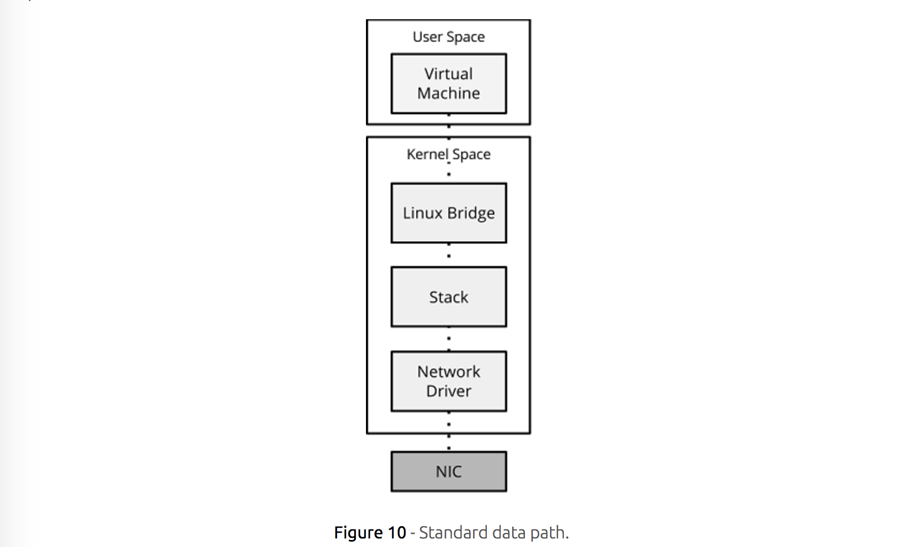
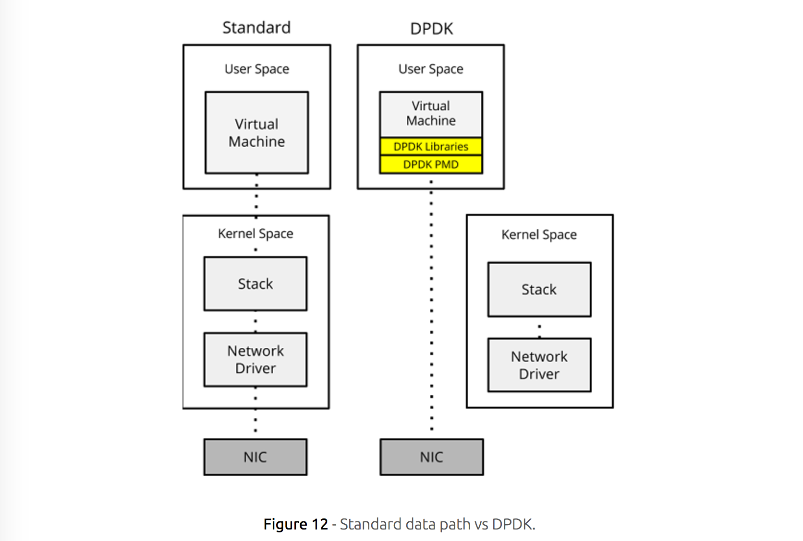
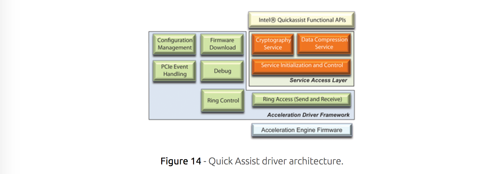

# A Guide to Network Function Virtualization (NFV)

- Hiroki SHIROKURA
- slank.dev@gmail.com
- 2017.08.03

これは私なりの要約である

[Original Link (en)](https://www.fir3net.com/Networking/Concepts-and-Terminology/a-guide-to-network-function-virtualisation-nfv.html)


## Introduction

NFVは数年前からあった用語です. <br>
ベンダーとオープンソースコミュニティがNFVの採用を推進するようになるにつれて,
新しい頭字語と流行語の波が業界全体に広がっています.
この記事では, NFVシステムを構築するために必要なさまざまなNFVコンポーネント
(標準, プラットフォーム, アクセラレーション技術など)について説明します.

## What is NFV?

まず第一に - NFVは何ですか？ <br>
NFV(ネットワークファンクション仮想化)は, 現在, 物理ハードウェア
(ファイアウォール, ルータ, ロードバランサなど)上で実行されている
ネットワーク機能を標準のコモディティハードウェア上で仮想化する概念です.

## Advantages

NFVはOPEX(運用支出)とCAPEX(資本支出)の両面で数多くの利点をもたらします.
彼らは,

- 購入 <br>
  さまざまなベンダーからのさまざまなネットワークハードウェアラインの購入を
	無効にすることができるため, 購入ラインを削減し, 簡素化することができます.
	代わりに, 標準的なx86サーバーベンダーを使ってVNF(仮想ネットワーク機能)
	をホストすることができます.
- スケーリング<br>
  VNFをすぐに構築できるため, 垂直または水平スケーリングの柔軟性が向上します.
- プロビジョニング<br>
  物理サーバを購入してケーブル接続する時間と比較して, プロビジョニング時間が
	大幅に短縮されます.
- 電源/冷却<br>
  複数のVNFを1台のサーバーで実行できるため,冷却と電力消費が大幅に削減されます.
- ライセンス<br>
  場合によっては, VNFのライセンスは, 物理的なものと比較して安くなります.
- ハードウェアEOL<br>
  ハードウェア からソフトウェアを切り離すため,
	物理的なネットワークハードウェアは必要ありません.
	つまり, ベンダーのさまざまなEOL /製品ライフサイクルと,
	ハードウェアのリフレッシュに関連するコストのかかるプロジェクトには
	結びつかないということです.

## Trameworks and Standards

ETSI NFV ISG <br>
欧州電気通信標準化機構 ( ETSI )は, 電気通信業界における独立した非営利の
標準化組織です. 2012年11月, NFVの必要基準を開発するとともに, NFVの実装と
テストの経験を共有するために, NFV Industry Specification Group(ISG)が
設立されました.  [1]

ETSI NFV Group Specification(GS) <br>
NFV Architectural FrameworkとNFV Management and Orchestrationという2つの
主要なETSIがあります.

NFVの建築フレームワーク

ETSI NFV ISGアーキテクチャフレームワーク(ETSI GS NFV 002)は,
ネットワーク機能の仮想化に必要なさまざまな要素を定義することによって,
NFVを標準化します.  このフレームワークには,  高レベルNFVフレームワークと
参照アーキテクチャフレームワークの 2つの主要セクションが含まれています .

高レベルのNFVフレームワーク - このフレームワークは, 物理インフラストラクチャと
仮想インフラストラクチャにおけるネットワーク機能の実装を高いレベルで
記述しています.  これは, 3つのNFV作業ドメインに基づいています.

- VNF(仮想ネットワーク機能)<br>
  NFVI上で実行できるネットワーク機能のソフトウェア実装.

- NFVI(NFV Infrastructure)<br>
  計算, ストレージ, ネットワーキングなどの VNFの ホストと接続に使用される
  一連のリソース(物理または仮想).

- NFV管理とオーケストレーション(MANO)<br>
  VNFの プロビジョニングに必要な管理とオーケストレーション,
  ライフサイクル管理をカバーします.

<p></p>

NFVリファレンスアーキテクチャフレームワーク
このフレームワークは, 前述のハイレベルNFVフレームワークを拡張します.
機能ブロック, その相互作用, およびネットワーク機能の仮想化の結果として
オペレータのネットワーク内で発生する可能性のある変更にさらに焦点を
当てています.
Management and Orchestrationドメイン内の新しい機能ブロック
(次のセクションでさらに説明する)に加えて, OSS / BSSとEMSの追加,
および他のNFV作業ドメインへのリンク方法も見ることができます.

<p></p>

OSS / BSSとEMSの用語の定義を以下に示すが,

OSS(Operational Support Systems) <br>
電気通信, 通信ネットワークを運用, 提供, 維持するバックオフィス活動を
サポートするソフトウェア(時にはハードウェア)アプリケーション.

BSS(Business Support Systems) <br>
請求, 注文管理, 顧客関係管理, コールセンターの自動化など,
顧客対応の活動をサポートする電気通信ソフトウェアアプリケーションです.  [4]

EMS(要素管理システム) <br>
同じノードの単一またはグループに管理(構成, アラーム管理など)を実行します.

NFVの管理とオーケストレーション(MANO)

NFV管理およびオーケストレーション(MANOとも呼ばれます)グループ仕様では,
VNFのプロビジョニング方法, 構成, およびインフラストラクチャの展開を実行
するためのフレームワークが定義されています.

コンポーネント<br>

MANOは エンティティ, 記述子ファイル ,  リポジトリ,  機能ブロックの
周りに構築されてい ます .

エンティティ<br>
エンティティは,  ETSI MANOベースの環境を形成する 基本的な 要素です.

- Virtual Deployment Unit(VDU)
  仮想機能をホストするVMを 表し ます.
- 仮想リンク(VL)
  VNF間の接続を提供します.
- 接続ポイント(CP)
  仮想リンクの対応する接続ポイント.
- ネットワークサービス(NS )
  VNF, VNF転送グラフ, 仮想リンク(VL), および接続ポイント(CP)のセットで,
	一緒に「ネットワークサービス」を形成します.
- VNF Forwarding Graph(VNFFG)
  単一または仮想リンク(VL)/接続ポイント(CP)
  のいずれかを介して,  VNF間の 1つ以上の転送パス.
- バーチャルネットワーク機能(VNF)
  以前は独自の専用ハードウェアによって実行された仮想化タスク .
- 物理ネットワーク機能(PNF)
  特定のネットワーキング機能, すなわちファイアウォールを提供する目的で
	構築されたハードウェア.

記述子ファイル<br>

各要素について, 記述子ファイル, すなわちNSD, VNFD, VNFFGD, VLD, CPD
などがある. 各記述子ファイルは, 所与のエンティティの構成パラメータを記述する.

リポジトリ<br>
リポジトリはETSI MANOに情報を保持します. 主なリポジトリの種類は4つあります.

- NSカタログ
  使用可能なすべてのネットワークサービス記述子(NSD)のリポジトリ.
- VNFカタログ
  すべての使用可能なVNF記述子(VNFD)のリポジトリ.
- NFVインスタンス
  すべてのVNFインスタンスとネットワークサービスインスタンスの情報を保持します.
- NFVIリソース
  エンティティを実行するために利用されるNFVIリソースのリポジトリ.


機能ブロック<br>
上記のすべてを編成するために, NFV MANOは3つの機能ブロックで構築されています.

- NFV Orchestrator(NFVO)
  新しいネットワークサービス(NS),VNFFG,およびVNFパッケージを搭載しています.
	NFVIリソース要求を承認し, 検証します.  それに伴い, NSのライフサイクルを
	管理し, NFVI要求の検証/承認を実行します.
- VNF Manager(VNFM)
  FCAPS(障害, 構成, 会計, パフォーマンスおよびセキュリティ管理)とともに,
	作成および終了などの VNF のライフサイクルを管理します.
- 仮想インフラストラクチャマネージャ(VIM)
  仮想/物理コンピューティング, ストレージ, ネットワークリソースなどの
	NFVI(ネットワークファンクション仮想化インフラストラクチャ)を
	制御および管理します.  イベントとパフォーマンスメトリックの収集に加えて

<p></p>

注記<br>
3つの主要なMANO構成要素の間の各基準点の仕様は, ETSI GS NFV-IFA 006-008文書内に
置くことができる.  この基準点の標準化により, マルチベンダーの
ETSI MANOプラットフォームを構築する際の相互運用性が可能になります.


## Modeling

オアシストスカ<br>
クラウドベースのWebサービス, コンポーネント, 関係, およびそれらを管理する
プロセスのトポロジを記述するための, OASISの標準言語である,
クラウドアプリケーション (TOSCA)の トポロジとオーケストレーションの仕様 .
[5] これは, 基盤となるプラットフォームやインフラストラクチャに関係なく,
クラウドプロバイダー間で移植性と無関係な自動化管理を実現します.  [6]

つまり,TOSCAを使用すると,アプリケーション全体を1つのテンプレートにモデル化し,
それを使用してアプリケーションを第三者のインフラストラクチャ(クラウド)に
展開することができます.

コンポーネント<br>
TOSCAはアプリケーション全体をどのようにモデリングしていますか？
まずはサービステンプレート (図4)から始めます. サービステンプレートは,
アプリケーションの構造(トポロジテンプレート)とオーケストレーション(計画)
を指定するために使用されます.

<p></p>

次に, ノード型 と リレーションシップ型があり ます.

- ノードタイプ <br>
  計算,データベース,ネットワークなどのトポロジ内のコンポーネント
- Relationship Types <br>
  ノードが互いにどのように接続されているかを説明します.

ノード型とリレーションシップ型の両方には,プロパティとインタフェースが含まれます.

- プロパティ <br>
  ノードタイプのプロパティ. すなわち,Node TypeがComputeの場合,プロパティには
	RAM,CPU,ディスクなどが含まれます.
- Interfaces <br>
  これは,TOSCAオーケストレーターが操作を実行するために使用する
	エントリーポイントです(「デプロイ」,「パッチ」,「スケールアウト」などの
	ライフサイクル操作など)

ビルディングブロックが完成したので,トポロジテンプレートを構築できます.
これは ノードテンプレート と リレーションシップテンプレート から構築されます.
テンプレートはタイプのインスタンスです.つまり,ノードテンプレート(インスタンス)
はノードタイプ(クラス)のオカレンスです.

さらに,サービステンプレートの外には, ポリシー と ワークフローがあり ます.

- ポリシー <br>
  ノードの条件または一連のアクションを定義します. オーケストレーターは,
	トリガーするイベントに対してPolicy内の条件を評価します.
	必要なアクションは,対応するインターフェースに対して実行されます.
- ワークフロー <br>
  手動で定義された一連のタスクを順番に実行するように定義できます.

最後に,TOSCAは 代替マッピング と呼ばれる機能をサポートしています .
これにより,基本的にサービステンプレート全体を取り出し,
別のサービステンプレート内で再利用することができます.
たとえば,図5は,データベースの再利用による例を示しています.

<p></p>

トスカNFV<br>
あなたは質問しているかもしれません - これはNFVにどのように適用されますか？

再利用性(すなわち置換マッピング)に関するTOSCAsの柔軟性は,
ネットワークトポロジーの記述に理想的です.
これだけでなく,ポリシー(VNF監視/スケーリング)とともにワークフロー
(VNFライフサイクルを考える)を定義する能力は ,NFVに 非常に 適しています.

さらに,TOSCAは,ETSI MANOに基づいて,NFV固有のデータモデルを指定します.
これにより,ネットワークサービス,VNF,VNFFGなど,MANO内のさまざまな
エンティティをモデル化する機能が提供されます.

図6では,TOSCA NFV標準を使用して構築されたVNFDの例を見ることができます.
このVNFDは,1つのvCPU,512MbのRAM,1Gbのディスク,アンチスプーフィングを
無効にした単一の管理インターフェイスでVNFを構築します.

<p></p>


## SDN and NFV

NFVとSDN(Software Defined Networking)との違いは何ですか？  <br>
これに答えるために,SDNが提供する役割を見てみましょう.SDNは,
ネットワーク制御プレーンをデータプレーンから分離する概念です.
2つをデカップリングすることで,集中モデルが可能になります.
これにより,ネットワークのプログラミングが可能になるだけでなく,
計算と管理の集中化も可能になります.

NFVの役割を見てみましょう. われわれが知っているように ,基盤となる物理的な
ハードウェア から コモディティベースのサーバーに ネットワーク機能を抽象化
することです.  一面ではSDNとNFVは同じですが,別のもので見ることができます.
彼らはどちらもネットワーク抽象化のレベルを実行しようとします.
ただし,その抽象化の範囲は 多少 異なります.

それでもなお,混乱が見られることがあります. 定義された一連のサービス機能を
使用して特定のフローでトラフィックステアリングを選択して実行する技術である
Service Function Chaining(SFC)の役割を果たすことにしましょう.
この役割を果たすために,SDNを使用して制御プレーンをプログラムし,
それに応じてフローを調整します. しかし一方では,EF MANOベースのモデル
(後述の章で説明します)内のNFVOなど,NFVオーケストレーションレイヤを
介して作成された一連の記述式を介して,一連のVNFを介してトラフィックを
誘導しています.

いずれにしても,SDN/NFVワーキンググループと現在進行中の技術のスルーに基づいて,
これらのような矛盾するトピックが確実に時々発生することを覚えておくことは
重要です. しかし,ポイントをあまりにも上げてはいけません.
ネットワーク内で抽象化しようとしているものが明確である限り,NFVとSDN- SDNの
主な違いは コントロールプレーンの抽象化を解決する ことができます.
NFVはハードウェア抽象化を解決します.


## Virtual Switches

もちろん,ネットワーキング機能の仮想化は素晴らしいですが,仮想ネットワークや
物理ネットワークに接続する方法がない場合はほとんど役に立たないでしょう.
このため,仮想スイッチはNFVの世界で非常に重要な役割を果たします.

このセクションでは, Linux Bridge , OVS , および VPP 仮想スイッチング技術
について説明します.

### Linux Bridge

Linux Bridgeは2.2で最初に導入されたカーネルモジュールであり,
ソフトウェアベースの切り替えを提供します. STP(スパニングツリープロトコル),
802.1Q VLANタギング,およびフィルタリングをサポートしながら,
MACフォワーディングテーブルを使用して複数のインターフェイスにレイヤ2パケット
スイッチングを提供します. フィルタリング(レイヤ2)は,レイヤ3およびレイヤ4
などの上位ネットワークレイヤをフィルタリングするためのebtableおよび/または
iptablesを介して実行されます.

### OvS

オープンvSwitchは,多層ソフトウェアベースのスイッチです.
OVSは,KVMやXEN [10] などのLinuxベースのハイパーバイザー用に設計された
機能豊富なバーチャルスイッチ製品がなかったため,オープンソースコミュニティの
ニーズを満たすことを目的としていました .その主な機能には,802.1Q VLANタギング,
LACP,QoS,およびさまざまなトンネリングプロトコル(GRE,VXLAN,STT,LISPなど)
のサポートなどがあります. さらに,OVSはOpenFlowをサポートしています.
これにより,コントローラーを使用してパケットのフローをプログラムで
設定することができ,多くのSDNソリューションで,事実上の標準的な
仮想スイッチングオプションになります.

フロー転送の場合Open vSwitchはすべての新しいフローをユーザ空間ovs-vswitchd
(低速パスと呼ばれます)経由で転送します.
これにより,ノースバウンドコントローラはOpen vSwitchをいずれかを介して設定し,

- OVSDB <br>
  ポート,ブリッジ,およびインタフェースの作成,削除,変更など,
  OVS自体を設定します. [11]

または

- OpenFlow  <br>
  フローエントリをプログラムするために使用されます.

新しいフローがユーザ空間内のovs-vswitchdを通過すると,フローはカーネル内に
キャッシュされます. それ以上のフローはキャッシュに対して照合され,
OVSカーネルデータパスによって転送されます.これは高速パスと呼ばれます.

<p></p>

OVSには, Normal と Flowという 2つの展開モードがあります .

- 通常<br>
  通常モードでは,各OVSは通常のレイヤ2ラーニングスイッチとして機能します.
	つまり,送信元MACアドレスは入力ポートに対して受信フレームごとに学習されます.
	フレームは,MACアドレスに基づいて適切なポートに転送されるか,
	またはMACアドレスがまだ学習されていない場合,またはマルチキャストまたは
	ブロードキャストフレームである場合は,すべてのポートにフラッディングされます.
- フロー <br>
  転送の決定は,OpenFlowプロトコルの使用によるフローを使用して行われます.
	フローは,ノースバウンドのAPI,つまりコントローラ(コントロールプレーン)
	から受信され,Open vSwitchesデータプレーンに実装されます.
	OpenFlowの詳細については, こちらをご覧ください .

### VPP

VPP(Vector Packet Processing)はもともとシスコが作成したもので,
現在はFD.ioプロジェクトの一部です. これは高速ルーティング/スイッチングを
提供するDPDKの上で動作するユーザスペースアプリケーションです.
FD.ioは次のように定義します.

> VPPプラットフォームは,すぐに使用できる品質のスイッチ/ルータ機能を提供する
> 拡張可能なフレームワークです. シスコのVector Packet Processing(VPP)
> テクノロジのオープンソースバージョンです.汎用CPUで実行できる高性能の
> パケット処理スタックです.
> VPPのこの実装の利点は,高性能で実証済みのテクノロジー,そのモジュール性と
> 柔軟性,豊富な機能セットです. [12]

VXLAN,IPSEC,MPLS,VRF,ECMP,およびL2 ACL(ただしこれに限定されない)
などの幅広いL2 / L3テクノロジをサポートしています.

VPPはユーザー空間プロセスとして実行され,DPDK(IO Optimizationセクションに
含まれています)と統合され,割り込みなしのデータパスをカーネル空間外に提供します.

しかし,どのように機能するのですか？ VPPは,パケット処理グラフ(図8)を
介してパケットのベクトルを処理することによって動作します.
グラフ全体を通して単一のパケットを処理する代わりに,パケットのベクトルは
最初に単一のグラフノードを通して処理される.
完了すると,次のグラフノードを介して処理されます.

<p></p>

ベクトルの最初のパケットがキャッシュをスピンアップします.
さらなるパケットは非常に迅速に処理されます. VPPの1つの類推は,

> 木材の各部分が切断され,研磨され,孔が穿孔される必要がある木材のスタックの
> 問題を考えてみましょう. 一度に1つのツールしか手に入れることはできません
> (命令キャッシュに似ています). 最初に鋸を拾い,すべての切断を行い,
> その後にサンダーを拾い上げてすべてのサンディングを行い,ドリルを拾い上げて
> すべてを行うならば,裁断,サンディング,および掘削をより速く完了することに
> なりますあなたの掘削. 木材1枚ごとに各工具をピックアップするのがはるかに
> 遅くなります. [14]

VPPグラフが提供するパフォーマンス上の利点に加えて,新しいプラグインと
拡張機能を導入する能力も非常に柔軟です.


## Optimization

NFVに関して重要な懸念事項の1つは,パフォーマンスに関するものであり,
仮想化しているネットワーク機能がハードウェアのものを提供できることです.
ただし,ASIC,FPGA,暗号エンジン,SSLアクセラレータなどの専用ハードウェアを
使用することで,ハードウェアベースのプラットフォームが最速となるように競争
するすべてのベンダーは,仮想化されたインスタンスが実際に競合することが
できますか？

このセクションでは,仮想ネットワーク機能のパフォーマンスを大幅に向上させる
ために使用できる,業界内で利用可能なさまざまな最適化手法と技術について説明
します.

システム最適化

NUMA

従来,SMP(Symmetric Multiprocessor)マシンでは,システム内のすべての
CPUが同じメモリにアクセスします. しかし,CPUの技術が進化し,CPUの
性能が向上するにつれて,メモリバスへの負荷と,CPUがメモリからデータが
到着するのを待つ時間が増加しました.

NUMA(Non-Uniform Memory Access)は,メモリを複数のメモリノード(またはセル)
に分割することでこれを処理します.複数のメモリノード(またはセル)は,
1つまたは複数のCPUに対して「ローカル」です. [15]

NUMAノードは相互接続を介して接続されているため,すべてのCPUがすべてのメモリに
アクセスできます. インターコネクトのメモリ帯域幅は通常,個々のノードのメモリ
帯域幅よりも高速ですが,多くのノードからの同時クロスノードトラフィックに
よっても圧倒される可能性があります. [16] したがって,NUMAは
ローカルメモリノードにアクセスするCPUのメモリアクセスを高速化しますが,
(インターコネクト経由の)リモートメモリノードへのアクセスは遅くなります.
ここではNUMAトポロジーの認識が必要です.


<p></p>

CPUピンニング

ハイパーバイザーがゲストのvCPUを仮想化する場合は,通常,システム内のどのコア
でもスケジュールされます. もちろん,この動作は,NUMAノード内のCPUコア間または
NUMAノード間のCPUコア間で仮想CPUがスケジューリングされるため,最適な
キャッシュパフォーマンスにつながる可能性があります. [18] CPUのピン割り当ては,
仮想CPUがどの物理CPUを実行するかを制限する機能を提供します.その結果,
CPUからのメモリ読み込みと書き込みが高速になります.

巨大なページング

システム内では,プロセスは仮想メモリ(ページとも呼ばれます)で動作します.
仮想メモリは物理メモリにマッピングされ,マッピングはページテーブルと呼ばれる
データ構造内に格納されます.

プロセスがメモリにアクセスするたびに,カーネルは このページテーブルに [19]
を 書き込むことによって,望ましい仮想メモリアドレスを物理アドレスに変換ます.
しかし,ページテーブルは非常に複雑で低速で,一部のプロセスがメモリにアクセス
するたびにデータ構造全体を解析することはできません. [20] ありがたいことに,
CPUにはTLB(Translation Lookaside Buffer)と呼ばれるハードウェアキャッシュが
含まれており,物理から仮想へのページマッピングがキャッシュされ,ルックアップ
が高速化されます. ただし,TLBの容量は限られています.
これは巨大なページが入る場所です.ページのサイズを大きくすると,TLB内で
より多くのメモリをマッピングし,キャッシュミスを減らし,メモリアクセス時間を
短縮することができます.

```
                   Pagesize     TLB-Entry      Map-Size     Ex
----------------------------------------------------------------------------
Without Hugepages  4096B        512            2MB          4096B*512=2MB
With Hugepages     2MB          512            1GB          2MB*512=1GB
```

I / O最適化

まず,さまざまなパケット最適化手法について説明します.まず,パフォーマンスの
低下を引き起こす可能性のある問題のいくつかを見てみましょう.VNFが今日の
ネットワークで要求される低遅延10Gbの速度に達するのを防ぎます.

図10に基づいて,仮想インスタンスとともに仮想スイッチを備えたシステムがあります.
ハイパーバイザーとLinuxブリッジ(つまり仮想スイッチ)は,カーネルモードで
実行され,仮想マシンはユーザーモードで実行されます.

より詳細にフローを見てみましょう.

NIC to Linux Bridge - フレームがNICによって受信されます. それは,
DMA(ダイレクトメモリアクセス)を介して,事前に割り当てられた
RXシステムメモリバッファに直接移動される. NICはCPUに割り込み要求を発行し,
フレームがRXメモリバッファからカーネルスタックに移動することを要求する.
これは,カーネルドライバによって実行されます.

残念なことにハードウェアの割り込み(CPU使用量の点で)は高価です.
プロセッサは,現在実行している処理を中断し,その状態を保存し,
次にイベントを処理する割り込みハンドラを初期化することをプロセッサに
要求する優先順位の高い状態をCPUに警告する.

フレームがカーネル内に入ると,フレームはネットワーク・スタックを介して
Linux Bridgeまで処理されます. しかし,カーネルネットワークスタック
は本質的に遅いです. ARPからVXLANまで,さまざまな機能やプロトコルを
処理しなければならず,すべてを安全に行う必要があります. [21]

Linuxブリッジから仮想インスタンスへのブリッジ - フレームがLinuxブリッジに
よって受信され,パケットが仮想マシン向けであることを判別するために必要な
操作が実行されると,カーネルはシステムコールを実行します.

システムコールはコンテキストスイッチを開始します. これにより,
CPUが異なるアドレス空間で動作するように切り替わります. これにより,
ユーザー空間内で実行されている仮想インスタンスがカーネル空間に
「コンテキスト切り替え」し,フレームをさらに処理できるようにユーザー空間に
戻る前にフレームを取得できます. もちろん,これは非常に効率的ではありません.
パックを取得するには,実際のデータ(/フレーム)のコピーを実行するために
必要なコスト/オーバーヘッドはもちろん,仮想インスタンスは各IO要求に対して
何をしているのかを停止する必要があります2つの異なるアドレス空間


<p></p>

このフローは大幅に簡素化されていますが ,フレームをカーネルデータパスと
システムメモリ空間の間で移動させることは計算コストが高いことを強調しています.

SRIOV

SR-IOV(シングルルートI / O仮想化) は,PCI Express(PCIe)仕様の拡張版です.
VMごとに個別の物理NICのように動作するVirtual Functions(VF)が作成されます.
NICのVFには,それがサービスする特定のVMによって所有されているユーザ空間メモリが
どこにあるかを示すディスクリプタが与えられます.
これにより,NICとの間で送受信されるデータを,DMA(ダイレクトメモリアクセス)
経由で直接VMとの間で転送し,仮想スイッチをバイパスし,割り込みのない動作を
提供し,高速パケット処理を実現します. しかし,欠点があります. VMとVFとの
間の直接的なアクセスにより,仮想スイッチ間の何かがバイパスされる.

仮想関数に加えて,SR-IOVは物理関数(PF)も提供します. 物理機能は,
他のPCIeデバイスと同様に検出,管理,操作が可能な完全機能のPCIe機能です.
これらは,SR-IOV機能構造を含み,SR-IOV機能(仮想機能の設定や構成など)
を管理します.

<p></p>

DPDK

DPDK(データプレーン開発キット)   高速パケット処理のためのさまざまな
ユーザ空間ライブラリとドライバからなるフレームワークです. [23]
もともと,x86ベースのCPU上で動作するようにIntelによって開発されたDPDKは,
IBM POWERやARMなどの他のCPUタイプをサポートしています.

DPDKは,パケットスループットを最適化するためにいくつかの手法を使用しますが,
ファーストパス と PMDに 基づいています(そのパフォーマンスの鍵となります) .

ファストパス(カーネルバイパス)   - ファストパスは,NICからカーネルを
バイパスしてユーザー空間内のアプリケーションに作成されます.
これにより,ユーザ空間/カーネル空間の間でフレームを移動するときの
コンテキスト切り替えが不要になります.
さらに,カーネルスタック/ネットワークドライバを否定することで,
さらに利益を得ることができます.

ポールモードドライバ - フレームが受信されたときにNICがCPUに割り込みを
発生させる代わりに,CPUはポーリングモードドライバ(PMD)を実行してNICに
常に新しいパケットをポーリングします.
ただし,これは,CPUコアをPMDを実行するために専用に割り当てて割り当てる必
要があることを意味します.
さらに,DPDKフレームワークには次のものが含まれています.

バッファー・マネージャー は,ネットワーク・バッファー・キューの
割り振り/割り振り解除を最適化します.
メモリノード間の高価なメモリ操作を回避する NUMAの 意識.
CPUのTLB内の物理 - 仮想ページのマッピングを最適化するための Hugepages

<p></p>

DPDK対応のCPUだけでなくDPDK対応のNICも必要(大抵のIntelNICなら大丈夫)

OVS-DPDK

ボックスの外でOVSはカーネルベースのデータパスと,ユーザスペースデーモン
ovs-vswitchd(図13)を実装しています. このデーモンは新しいフローを処理し,
北向きのコントローラがプログラムでコントロールプレーンを更新できるようにします.
しかしながら,これは,フレームがカーネル内にキャッシュされているにもかかわらず,
仮想関数による処理のためにユーザ空間に移動されなければならないという問題が生じる.
既に見てきたように,フレームをアドレス空間の間で切り替えるコンテキストは,
CPUサイクルに関して高価です.


<p></p>

Open vSwitch(OVS)は,OVS 2.2でDPDKのサポートを導入しました.
OVS-DPDKは,OVSカーネルのデータパスをユーザー空間に移動します.
ポールモードドライバ(PMD)を使用してNICから直接フレームを取得し,
カーネルをバイパスすることができます.
フレームとVNFの両方がユーザー空間内にあるので,vHostユーザーなど,
OVSとVNFの間でフレームを移動するための技術をさらに使用できます.

vHostユーザー はOVS 2.4.0で導入されたドライバで,QEMU(仮想化ソフトウェア)
がゲストの仮想キューのメモリ位置をDPDKと共有できるようにします.
QEMUは,OVSDPDK内のドライバのバックエンド実装を介してメモリ割り当てを共有しする.
これにより,OVS-DPDKはDMAを介してキュー間でフレームを送受信でき,
パフォーマンスが大幅に向上します.

暗号化の最適化

AES-NI

もともとIntelによって開始された
AES-NI(Advanced Encryption Standard New Instructions)は,
IntelおよびAMDベースのCPU用のx86命令セットの拡張版です.
命令セットの目的は,暗号化および復号化を実行するアプリケーションの速度を
向上させることです.   高度な暗号化規格 (AES). [24]
これにより,SSL終了を実行するロードバランサやIPSEC VPNゲートウェイなどの
暗号ベースのVNFを高速化できます.

QUICKASSIST

Intel QuickAssistは,暗号化や圧縮などの計算集約型機能の高速化技術です.
使用例の例は,

対称暗号   暗号操作と認証操作を含む機能
RSA,Diffie-Hellman,楕円曲線暗号などの 公開鍵機能
圧縮および解凍   機能. [25]
QuickAssistは,27xx8および3xx8 Atom CPUに統合されています.
また,インテル®8925〜8955シリーズのインテル®チップセットにも組み込まれており,
インテル®ベースのCPUからの負荷を軽減できます.

APIを使用すると,QuickAssistはアプリケーションに公開されます(図14).
APIの役割は,Acceleration Driver Framework(ADF)およびService Access Layer(SAL)と
対話し,Acceleration Engineのファームウェアがアクセラレーションチップに存在することです.


<p></p>

## Projects

標準とフレームワークは素晴らしいですが,実際に使用する方法がない場合,
それは何ですか？

このセクションでは,ETSI MANOとフルスタックプロジェクトの両方を見て,
業界内の主要なオープンソースプロジェクトを見ていきます.
ETSI MANOは,NFVO,VNFM,VIMの役割の一部または全部をカバーしています.
データパス技術(DPDKなど),仮想スイッチング技術(OVS,VPPなど),
SDNコントローラなど,スタック全体を含むフルスタック

ETSI MANO

オープンソースMANO(OSM)

オープンソースのMANO は オープンソースのNFV MANOソフトウェアスタックを提供する
n個の ETSIホストプロジェクトです. OSMは,ETSIのIndustry Specification Group
(ISG)と連携しています. OSMの主な機能には ,次の ものが あります.

強化されたプラットフォーム認識(EPA) により,OpenStackはVMを最も適切な
プラットフォーム上で実行し,システムに組み込まれた機能から追加の利点を
得ることができます. [26]
SDNアンダーレイ制御 は,必要に応じて各リンクの帯域幅を保証します.
マルチVIM機能 - VMwareやOpenStackなどの複数の仮想インフラストラクチャ管理を
サポートします.
マルチテナントVNF -
マルチテナントVNF とシングルテナントVNFの導入と設定が可能です.

オープンバトン

オープンバトン は,ETSI NFV準拠のMANOフレームワークです.
Open Batonは,NFVOやVNFMなどの一般的なMANO機能の上に, 次の機能を提供します.

VNFのスケーリングを 可能にする 自動スケーリングエンジン .
障害の 自動管理に 使用される 障害管理システム .
オーケストレーションロジックに何かを書き直すことなく,
異なる VIM を追加および削除するための VIMプラグイン .
Zabbix Zabbix監視システムとの統合.
VNFM 独自のVNFMを構築できる ライブラリ .
OPENSTACK TACKER

Tacker は,VNFDのカタログ,VNFのプロビジョニング,VNFの設定管理,
VNFの監視と自動修復を提供するETSI MANO Architectural Frameworkを
ベースにした公式のOpenStackプロジェクトです. Tackerは 以下を 提供 します：

TOSCAモデリング - TOSCA NFVテンプレートを使用してVNFを記述 し,
Tacker VNFカタログに搭載されています. VNFは,TOSCAテンプレートを
OpenStack Heatに変換することによって開始されます.
VNFモニタリング   - ICMPまたはHTTP pingを介して実行されます.
VNFが応答しない場合 , Tackerはインスタンスを再構築してAuto Healを行います.
VNF構成管理
VNF成をプッシュできるようにベンダが開発できる構成ドライバを介して実行されます.

完全なスタック

ONAP

ONAP( Open Network Automation Platform )は,AT＆TのECOMPと
China Mobile / Telecoms Open-Oプラットフォームの統合に基づいて構築されています.
ONAPは,

> ...設計,作成,オーケストレーション,監視,およびライフサイクル管理のための
>   機能を提供するオープンソースソフトウェアプラットフォームは,
>
> - 仮想ネットワーク機能(VNF)
> - それを含むキャリアスケールのソフトウェア定義ネットワーク(SDN)
> - 上記の[27]を組み合わせた上位レベルのサービス

MANOの標準コンポーネント(VNFM,NFVOなど)は,
さまざまな豊富な機能を提供するために,いくつかの個別のONAPサービスと
コンポーネントに組み込まれています.
ONAPはOpen Baton,Tacker,OSMに見られるすべての機能を提供しますが,
以下のコンポーネント(ただしこれらに限定されません)
を含む幅広い追加機能も提供しています：

- アクティブかつ利用可能なインベントリ(AAI)
  利用可能なリソースとサービス,およびそれらの関係をリアルタイムで表示します.[28]
- マスターサービスオーケスト レーター (Master Service Orchestrator,MSO)
  管理された環境内の論理リソースと物理リソースの作成,変更,または削除を
	調整するためのルールとポリシーに基づいて,タスクをアレンジ,シーケンス,
	および実装します. [29]
- セキュリティフレームワーク
  ソースコードのセキュリティ分析,脆弱性のスキャン,脆弱性の修正,
	VNFからの分析およびネットワークデータに基づくポリシーの実行を可能にします.
- VNF の必要なワークフロー(ライフサイクル管理,アクティベーションなど)の
  定義,カタログ化,構築を可能にする SDC( Service Design and Creation)
	モデリング/設計ツール.

<p></p>

OPNFV

OPNFV( Open Platform NFV )は,OpenDaylight,ONOS,OpenStack,Ceph,KVM,
Open vSwitch,Linuxなどの既存のオープンソースプロジェクトを統合してNFVの
パッケージ化されたオープンソースプラットフォームを提供することを目的とした,
インフラストラクチャ(NFVI)および仮想化インフラストラクチャ管理(VIM)

OPNFVは他のオープン・ソース・コミュニティと協力して,
作業から得た貢献と学習の両方を,青写真,パッチ,および新しいコードの形で
それらのコミュニティに直接もたらします. [30]
アップストリーム寄稿に加えて,OPNFVには,OPNFV のさまざまなコンポーネントを
活用するDoctor(VNF自己修復)やMoon(セキュリティ管理)など ,
数多くのプロジェクトが あります.

<p></p>


## References

[1 ][1]   "ETSI - NFV." Accessed 22 Aug. 2017. <br>
[2 ][2]   "GS NFV 002 - V1.1.1 - Network Functions Virtualisation <br>
[3 ][3]   "GS NFV 002 - V1.1.1 - Network Functions Virtualisation <br>
[4 ][4]   "The Definition of OSS and BSS | OSS Line." 5 Dec. 2010, Accessed 22 Aug. 2017. <br>
[5 ][5]   "OASIS TOSCA - Wikipedia."  Accessed 21 Aug. 2017. <br>
[6 ][6]   "TOSCA - Oasis." Accessed 22 Aug. 2017. <br>
[7 ][7]   "Topology and Orchestration Specification for Cloud ... - Name - Oasis. Accessed 22 Aug. 2017. <br>
[8 ][8]   "TOSCA Simple Profile in YAML Version 1.0 - Name - Oasis.".  Accessed 24 Aug. 2017. <br>
[9 ][9]   "tacker/samples/tosca-templates/vnfd at master · openstack ... - GitHub". Accessed 24 Aug. 2017. <br>
[10][10]  "TripleO, NUMA and vCPU Pinning: Improving Guest ... - StackHPC Ltd." 3 Feb. 2017,  Accessed 24 Aug. 2017. <br>
[11][11]  "What is Open vSwitch Database or OVSDB? - Definition - SDxCentral."  Accessed 21 Aug. 2017. <br>
[12][12]  "VPP/What is VPP? - fd.io Developer Wiki." 26 May. 2017,  Accessed 21 Aug. 2017. <br>
[13][13]  "Technology – The Fast Data Project - FD.io." Accessed 24 Aug. 2017. <br>
[14][14]  "Technology – The Fast Data Project - FD.io." Accessed 21 Aug. 2017. <br>
[15][15]  "CPU Pinning and NUMA Awareness in OpenStack - Stratoscale." 15 Jun. 2016, Accessed 22 Aug. 2017. <br>
[16][16]  "Driving in the Fast Lane – CPU Pinning and NUMA Topology ...." 5 May. 2015, Accessed 24 Aug. 2017. <br>
[17][17]  "OpenStack in Production: NUMA and CPU Pinning in High ...." 3 Aug. 2015, Accessed 21 Aug. 2017. <br>
[18][18]  "TripleO, NUMA and vCPU Pinning: Improving Guest ... - StackHPC Ltd." 3 Feb. 2017,  Accessed 24 Aug. 2017. <br>
[19][19]  "Mirantis OpenStack 7.0 NFVI Deployment Guide: Huge pages." 25 Jan. 2016,  Accessed 24 Aug. 2017. <br>
[20][20]  "Advantages and disadvantages of hugepages – TechOverflow." 18 Feb. 2017, Accessed 24 Aug. 2017. <br>
[21][21]  "Pushing the Limits of Kernel Networking - Red Hat Enterprise Linux Blog." 29 Sep. 2015,  Accessed 22 Aug. 2017. <br>
[22][22]  "Using PCIe SR-IOV Virtual Functions - Oracle VM Server for SPARC ...." Accessed 21 Aug. 2017. <br>
[23][23]  "DPDK.org." http://dpdk.org/. Accessed 21 Aug. 2017. <br>
[24][24]  "AES instruction set - Wikipedia.". Accessed 21 Aug. 2017. <br>
[25][25]  "Intel Quickassist » ADMIN Magazine." . Accessed 21 Aug. 2017. <br>
[26][26]  "Openstack Enhanced Platform Awareness - Intel Open Source ...." . Accessed 24 Aug. 2017. <br>
[27][27]  "What is ONAP? - Developer Wiki - Confluence." 18 Jul. 2017, Accessed 25 Aug. 2017. <br>
[28][28]  "Active and Available Inventory (AAI) - Developer Wiki - ONAP." 13 Apr. 2017,. Accessed 25 Aug. 2017. <br>
[29][29]  "Master Service Orchestrator (MSO) - Developer Wiki - ONAP." 13 Apr. 2017, . Accessed 25 Aug. 2017. <br>
[30][30]  "Learn the Mission - Mission – OPNFV.". Accessed 22 Aug. 2017. <br>
[31][31]  "Enabling the Transition: Introducing OPNFV, an integral step towards ....". Accessed 21 Aug. 2017. <br>


[1]:http://www.etsi.org/technologies-clusters/technologies/nfv
[2]:http://www.etsi.org/deliver/etsi_gs/nfv/001_099/002/01.01.01_60/gs_nfv002v010101p.pdf
[3]:http://www.etsi.org/deliver/etsi_gs/nfv/001_099/002/01.01.01_60/gs_nfv002v010101p.pdf
[4]:http://www.ossline.com/2010/12/definition-oss-bss.html
[5]:https://en.wikipedia.org/wiki/OASIS_TOSCA
[6]:https://www.oasis-open.org/committees/tosca/faq.php
[7]:http://docs.oasis-open.org/tosca/TOSCA/v1.0/os/TOSCA-v1.0-os.html
[8]:http://docs.oasis-open.org/tosca/TOSCA-Simple-Profile-YAML/v1.0/csprd01/TOSCA-Simple-Profile-YAML-v1.0-csprd01.html
[9]:https://github.com/openstack/tacker/tree/master/samples/tosca-templates/vnfd
[10]:https://www.stackhpc.com/tripleo-numa-vcpu-pinning.html
[11]:https://www.sdxcentral.com/cloud/open-source/definitions/what-is-ovsdb/
[12]:https://wiki.fd.io/view/VPP/What_is_VPP%3F
[13]:https://fd.io/technology/
[14]:https://fd.io/technology/
[15]:https://www.stratoscale.com/blog/openstack/cpu-pinning-and-numa-awareness/
[16]:http://redhatstackblog.redhat.com/2015/05/05/cpu-pinning-and-numa-topology-awareness-in-openstack-compute/
[17]:http://openstack-in-production.blogspot.co.uk/2015/08/numa-and-cpu-pinning-in-high-throughput.html
[18]:https://www.stackhpc.com/tripleo-numa-vcpu-pinning.html
[19]:https://www.mirantis.com/blog/mirantis-openstack-7-0-nfvi-deployment-guide-huge-pages/
[20]:https://techoverflow.net/2017/02/18/advantages-and-disadvantages-of-hugepages/
[21]:http://rhelblog.redhat.com/2015/09/29/pushing-the-limits-of-kernel-networking/
[22]:https://docs.oracle.com/cd/E35434_01/html/E23807/usingsriov.html
[23]:http://dpdk.org
[24]:https://en.wikipedia.org/wiki/AES_instruction_set
[25]:http://www.admin-magazine.com/Archive/2016/33/Boosting-Performance-with-Intel-s-QuickAssist-Technology
[26]:https://01.org/sites/default/files/page/openstack-epa_wp_fin.pdf
[27]:https://wiki.onap.org/pages/viewpage.action?pageId=1015843
[28]:https://wiki.onap.org/pages/viewpage.action?pageId=1015836
[29]:https://wiki.onap.org/pages/viewpage.action?pageId=1015834
[30]:https://www.opnfv.org/about/mission
[31]:https://www.opnfv.org/blog/2014/09/30/enabling-the-transition-introducing-opnfv-an-integral-step-towards-nfv-adoption


