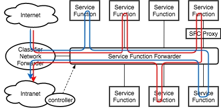
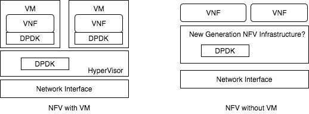

# Susanow計画に向かうストーリー

本計画は近年のNW技術のいくつかの要素によって発起され, 勧められている.

- NFVの流行
- DPDKによる貢献
- 高い開発コスト

## Virtualization

利点
- 省電力
- メンテナンスの省力化
- インストール済みソフトウェアの使用期限の延長
- 予測可能なコスト
- スペースの節約
- 障害回復

## NFV (Network Functions Virtualization)

ネットワーク機能を仮想化技術で実現すること.
SFC: 複数のNFを数珠つなぎすることでフレキシブルにNFをカスタマイズ.

利点
- コストダウン
	- 値段(汎用サーバ << 専用HW)
	- 保守運用(統一的インターフェース,自動化)
	- サービスチェインによるオンデマンドなネットワーク構築
- 迅速
	- サービスの拡大/縮小
	- デプロイ, 機能拡張

可能になった背景
- 高速マルチコアCPUを搭載した高性能なパケット処理が可能
	- DPDK (No need to develop NOS)
- クラウドインフラは、リソースの可用性と使用を向上させる方法を提供
- 管理,制御APIのオープン化
- 業界標準の大容量サーバ

課題
- Portability/Interoperability
- Performance Trade-Off
- Manage & Orchestration
- Automation

## SFC (Service Function Chaining)

- 汎用機で複数のNFを繋げてうごかす
- 迅速にサービスを拡大/縮小
- ex) Router → Router+IDS
- 多くがVMを用いてVNFを実現
- DPDKとVMの相性は?

現状の接続ポイント例
- KVMをHVとしたNFV
	- OvS-dpdk
	- BESS
	- SR-IOV
- non KVMのNFV
	- NetVM
	- Susanow

関連技術など
- NSH (Network Service Header): SFC Chaing designのためのプロトコル

## OpenDaylight

- not only OpenFlow Controller
- Supports: BGP, OpenFlow, NETCONF
- Controllerとしては世界でもっとも知名度が高い?
- 商用サポートあり

## Open vSwitch (OvS)

- OpenFlow vSwitch developed as OSS
- Linuxのbridgeと互換性あり
- DPDK利用可能

## OvS-DPDK

- パケット処理をDPDKによってアクセラレーション
- VM上, HV上の両方でDPDKを使うことが高性能化の条件
- ただ使うだけでなく, VMの仮装NICの種類によって性能が変化する

仮装NIC
- virtio, e1000
- vhost\_user
- vhost\_net

- OVS用にいくつかのCPUを使用する
- {sum of vCPU} > {num of cores}になったら, vm\_entry, vm\_exitの数が上昇?
- DPDKのCPUpinningの効果が低減
- VM上で動くVNFが一般的なDPDK VNFならまとめて管理をできる

## DPDK (Data Plane Development Kit)

4 Big Features
- Numa awared Memory management system
- Network Stack bypassing for High speed Packet I/O
- CPU Assignment for bypass context switch
- Data structure & Algorithm for packet-processing

概要　
- これによりLinux上での高性能通信が可能になった
- 高い開発コストである
- DPDK VNFの性能はCPU数でスケール
- プログラミングモデル: Run-to-Completion, Pipeline

キーワード 
ソフトウェアパイプライン/NICコンフィグ/ゼロコピー/排他制御

**最適なスレッドデザインで広帯域,程遅延を実現せよ**

## DPDKをKVM上で動作させる場合

- KVM, OvS-dpdk
- KVM, SR-IOV
- Susanow

## KVMとDPDK

利点: 高いセキュリティ, 抽象性

欠点:
- VMオーバヘッド
- VMのコンピュータ構成の変更(vCPU数を動的に変化)
- VMのチューニング, VNFのチューニング
- DPDK性能はCPU数とNIC構成でスケール

現状vhost-userを使うことでゼロコピーを実現可能

## Vhost-user

- 最近導入されたKVMのvNICバックエンド　
- Guest, Hostでshare memをしてパケットを渡し合う
- socketファイルとして実装されている
- KVMの起動時にsock-pathを指定する

## NFVの課題

- NFVとVMの関係性
- VM, HV間でのパケット操作にボトルネックあり
- VMオーバヘッド
- DPDKの柔軟性をKVMが吸収する
- VMによるNFVによりパフォーマンス低下
	- VMの性能変更より迅速に性能を変更したい
	- VMオーバヘッドは考えていない
- 様々な情報は色々なタイミングで決定する
	- 企画次に決まる情報
	- デプロイ次に決まる情報
	- 実行中に決まる情報
- 高度に仮想化がすすみつつある現代ではHSPCRを実装しただけではだめ
- それを利用するフィールドの整備まで行わなければならない

