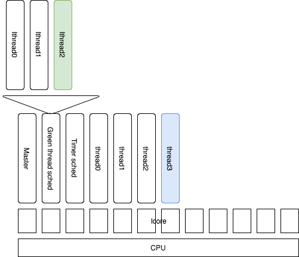
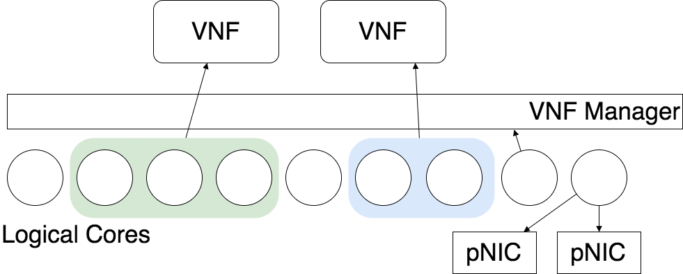
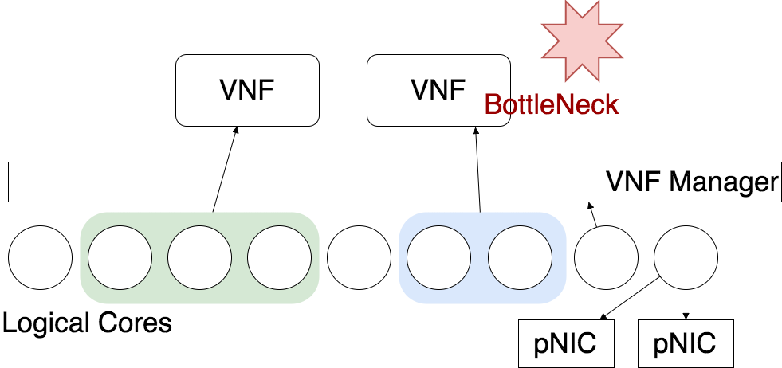
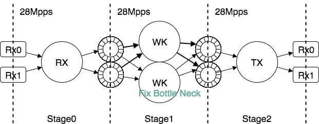

# Susanow:<br>環境に対して自動最適化する<br>高性能通信基盤

- Hiroki SHIROKURA @slankdev slank.dev@gmail.com
- powered by IPA-MITOU-program

===

## Introduction

城倉 弘樹 (SHIROKURA Hiroki) aka slankdev <br>
http://slankdev.net

活動
- セキュリティキャンプ 2015~
- Cybozu-Lab-Youth [拡張可能なパケット解析ライブラリ]
- Cybozu-Lab-Youth [高性能TCP/IPネットワークスタック]
- IIJii アルバイト [DPDK, BPF, 高性能パケット処理]
- 未踏事業 [環境に対して自動で最適化する高性能通信基盤]

---
## Agenda

1. Background, Motivation, Summary
2. System Design
3. Demonstration

---
## 本テーマの貢献とインパクト

- DPDK VNFの動的自動スケーリング
- NFV基盤として実装し, Chained VNFの最適化

環境に対して自動最適化する高性能通信基盤
- 環境: トラフィック状態, コンピュータリソース, etc
- 自動最適化: スレッドチューニングで全体スループットを最高性能化
- 高性能: スループットに重点, 10GbEx8, 40GbEx2,
- 通信基盤: notVM NFV Infrastructure

ターゲットは10GbE x4-8, 40GbE x4くらい<br>
まだ未完成. BCP(BestCurrentPractice)をお話します

```
コンピュータリソース100%10G
A33%10Gbps B33%05Gbps C33%20Gbps
A33%10Gbps B66%10Gbps C16%10Gbps
とする、アルゴリズムを開発する
```

ベンダのエコシステムを利用することができる. (要参考文献)

Susanow計画のワークロード
- スレッド最適化による環境に対して自動最適化する高性能通信基盤
- 上記を複数NFに適用させ, ネットワークスライスを最適化するNFV基盤
- 複数ノードを追加することにより無限にスケールするオーケストレータエージェント
- 開発した基盤上で動くNF複数種類 (VNFリポジトリ)
	- DPI, Router, FW, QoS
	- 帯域混雑時でも緊急電話に対応できる可用性99.9%のVoIP

開発者の本音
- NFVサービスチェインが迅速にいじれて高性能なことを売りにしたい
- できれば40coreくらい使いたい...
- 互換性を犠牲にパフォーマンスを高く要求した


---
## System Architecture

- DPDKのラップ
	- スレッド管理 (Native/Green)
	- port管理 (Physical/Virutual)
	- timer管理
	- その他
- VNF管理: 自動最適化エンジン
- フロントエンド (VTY)

<p></p>

Moduler Design

- ssn_thread
  - ssn_native_thread
  - ssn_green_thread
- etc...

---
## DPDKのラップ: Thread, Timer, Port (実装の話)

- スレッド管理 (Native/Green)
	- lthreadのスケジューラアクセスをシリアライズ
- timer管理
	- タイマーオブジェクトクラスとしてラップ
- port管理 (Physical/Virutual)
	- 仮装ポート,物理ポートのインターフェースを統一
	- 性能計測機能を追加

<p></p>

---
## VNFの設計

一般的に必要な要件: コンピュータリソースを与えると性能向上ができる

VNFに必要な機能
- stageの集合

Stageに必要な機能
- 多重化する機能(inc)
- 逆多重化機能(dec)
- 統計情報取得機能(性能,状態)
- 入出力ポート定義(物理,仮想)

---
## 自動最適化概要

1. 発火フェーズ
	- VNFを追加したり減らしたりするタイミングでOptimization
	- トラフィックが増えたり, 減ったりするタイミングでOptimization
	- タイマーで一定期間ごとに性能チェック. 低下したタイミングで発火
2. 発見フェーズ (環境情報より発見)
	- NICのスループット
	- スレッド状態(launch数,遅延)
	- 空きCPUの個数
3. 修正フェーズ
	- スレッドの多重度
	- NICチューニング

---
## 全体最適化手順
**step1** <p></p>
**step2** <p></p>
**step3** <p></p>

---
## VNF最適化手順
**step1** <p></p>
**step2** <p></p>
**step3** <p></p>

---
## 発火,発見,修正フェーズのアルゴリズム

```
void optimize_vnfchaing(vnf[] vnfs) {
	for (i=0; i<nb_vnfs; i++) {
		if (vnfs[i].has_perf_reduction()) {
			optimize_stage(vnfs[i]);
			return ;
		}
	}
}
void optimize_stage(vnf nf) {
	for (i=0; i<nb_stages; i++) {
		if (nf.stage[i].has_perf_reduction()) {
			nf.stages[i].inc();
			return ;
		}
	}
}
```

---
## Evaluation

- スレッド最適化による動的な性能変更
- SFCの最適化によるネットワークスライスの動的な性能変更
	- 非NUMA構成
	- NUMA構成
- 複数ノードでのクラスタリングの動的な性能変更
- 実装したVNFの個別な性能変更の確認
- これらを可能にするVNFのプログラミングモデル
- NFVを管理する独自プロトコルとそのAPI


---
## 解決する問題, ターゲット

実装するもの
- DPDKのスレッドチューニングの自動化
- no-VM NFV基盤
- これらの上で動くRouter

世間へのインパクト
- 性能変更が柔軟なRouter
- NFVサービスチェインをする新たなアプローチ
  VMを利用しないパターン

---
## ユーザに提供するもの, しないもの

すること
- VNF実装の独自のプログラミングモデルの提供
- それにそってVNFを実装すると実行時に必要に応じて
  ソフトウェアパイプラインを自動で最適化してVNFの性能を自動調節
- ユーザはNUMA nodeを考慮したプログラミングを行うことで
  自動チューニングの手助けをする

しないこと
- NIC構成の動的再構成はしない
  boot時にできるだけたくさんRingを用意してそれをソフトウェアでさばく

---
## 自動チューニングについて

利点
- 単純なRun2Completionはちゃんと自動スケールする

欠点
- 複雑なPipelineモデルの自動スケールがまだテストできていない
- チューニングの段階が広い (1,2,4,8コア割り当て)
- 自動チューニングが完全に動いてくれていない
	現状特定の状態までしかサポートしていない

---
## SMP l3fwd の対応に関して

以下のようにしてMultiQueueを監視する.
ただし若干の条件がある.

<p></p>

---
## NUMA l3fwd の対応に関して

<p></p>

---
## NUMA Lagopus の対応に関して

- 現在対応中
- どのようにスレッドを増やしていけるかがまだまとまっていない
- Lagopusに対応することができれば, Pipelineモデルの一般的な
  自動最適化ができそう
- Lagopusは対応できればする

---
## スレッド追加の完成度

- 2^n多重での自動チューニングに対応 <br>
  1,2,4,8,16,....
- Multi Ring構造に対応

---
## Emulated Multi Queue NIC

- 物理NICを動的に再構成するのは現実的に不可能
- 事前に多めにQueueuを用意しておく.
  それをSoftwareでうまく振り分けていく
	-> Overheadはどの程度か...
	-> Threadを増やせば増やすほど,Soft抽象化が減るので大丈夫

---
## Evaluation

- 動的最適化のEvel
	- l3fwd
- Function ChainingのEval
	- i.e. l3fwd + packet-capture
	- OvS, SR-IOV

---
## 今後の展望

うわさでまだ試していない内容
- Seaster + Schelaのマルチスレッド最適化が良い?
- HTが意味ないことの確認
- Inter Processorの性能低下　
- Click Moduler Routerのプログラミングモデルはさんこうになる

