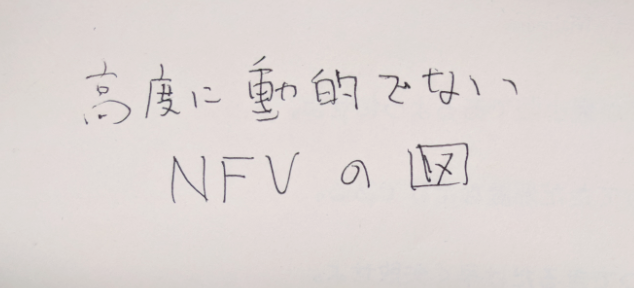

% Susanow:環境に対して自動最適化する高性能通信基盤
% \underline{Hiroki SHIROKURA} @slankdev slank.dev@gmail.com
% powered by IPA-MITOU-program

# Introduction

城倉 弘樹 (SHIROKURA Hiroki) aka slankdev  

- セキュリティキャンプ 2015~
- アルバイト
	- Cybozu-Lab 「拡張可能なパケット解析ライブラリ」
	- Cybozu-Lab 「高性能TCP/IPネットワークスタック」
	- IIJ研究所  「DPDK, BPF, 高性能パケット処理」

未踏事業 「環境に対して自動で最適化する高性能通信基盤」

# プロジェクト概要

「汎用サーバを用いた\underline{高性能}NFVを実現しよう」計画

[draft.susanow.dpdk.ninja](http://draft.susanow.dpdk.ninja)

- D2(Dynamic Thread Optimizaion) という技術を開発
- D2を用いた高度の動的なNFV基盤開発
- 開発中のNFV基盤上で動くVNF (開発中)
- NFVのいくつか空想を実現

# Background

- DPDKについて
- SDN/NFVの未来予想図

# DPDK: 多大な貢献

- 4つの特徴
- IAサーバ上でより高性能なパケットフォワードが可能
- 100Gクラスのトラフィックもパケットフォワード可能
- ボトルネックは経路検索などのアルゴリズム

{width=250}

# DPDK: 課題

- 高い開発コスト: コンピュータ理論に対する精通
- スレッド多重化率などのカリカリチューニング
- 高性能VNFは増えてきたが, オープン? 信頼性は?...
- VMオーバヘッド: 仮装NICのメモリコピー

{width=300}

# Network Function Virtialization

- ネットワーク機能を仮想化
- CAPEX/OPEX低減
- 迅速なサービス変形

# Service Function Chaining

- ネットワーク機能を細かく考える
- NFVの迅速性を利用し, 素早いサービス変形を柔軟に
- 現状は様々な方法で実現中(Openflowなど)
- プロトコルとしても標準化中

{width=350}

# NFVよ, より高度に動的になれ!

- 強度に合わせてサーバ増やすのは僕は好きじゃない

# Challenge

- DPDKのスレッドチューニングの自動化
- no-VM NFV基盤
- これらの上で動くVNF

# Susanow Architecture

{width=450}

# D2: Dynamic Thread Optimization

- Dynamic Thread Optimization -> DTO -> D2
- スレッド多重化を自動化 (no-lock/no-block)
- 設計したプログラミングモデルに従い利用 (C++11)
- VNFやサーバの数を増やすアプローチでない
- VNFやサーバそのものを動的に強化していく

{width=300}

# D2: どのタイミングでどの作業?

1. 発火フェーズ
	- VNFを追加したり減らしたりするタイミング
	- トラフィックが増えたり, 減ったりするタイミング
	- タイマーで一定期間ごとに性能チェック. 低下したタイミング
2. 発見フェーズ (環境情報より発見)
	- NICのスループット
	- スレッド状態(launch数,遅延)
	- 空きCPUの個数
3. 修正フェーズ
	- スレッドの多重度
	- NICチューニング (現状不可能)
	- VNFのマイグレーション (現状不可能)

<!-- # D2: Limitation -->
<!--  -->
<!-- - NIC構成の動的再構成はしない -->
<!-- - boot時にできるだけたくさんRingを用意してそれをソフトウェアでさばく -->
<!-- - 複雑なPipelineモデルの自動スケールがまだテストできていない -->
<!-- - 物理NICを動的に再構成するのは現実的に不可能 -->
<!-- - 事前に多めにQueueuを用意しておく. -->
<!--   それをSoftwareでうまく振り分けていく -->
<!-- 	-> Overheadはどの程度か... -->
<!-- 	-> Threadを増やせば増やすほど,Soft抽象化が減るので大丈夫 -->

# Progress and Future work

Susanow計画のワークロード

- スレッド最適化による環境に対して自動最適化する高性能通信基盤
- 上記を複数NFに適用させ, ネットワークスライスを最適化するNFV基盤
- 複数ノードを追加することにより無限にスケールするオーケストレータエージェント
- 開発した基盤上で動くNF複数種類 (VNFリポジトリ)
	- DPI, Router, FW, QoS
	- 帯域混雑時でも緊急電話に対応できる可用性99.9%のVoIP

# Demonstration

- スレッド最適化による動的な性能変更
- SFCの最適化によるネットワークスライスの動的な性能変更
- これはまた今度

# Performance Evaluation

- 懸念点
	- D2オーバヘッド: 何nsの処理オーバヘッドか?
	- VMオーバヘッドとどのように: スムーズに進むか?
	- スレッドの起動の速度は?
	- D2最適化中のトラフィックはどれだけどまるか
- 計測内容: 帯域, 遅延
- VNF: L2FWD, L3FWD, ACL, DPI

全て現在調べ中です. 8合目合宿までに!!

# Memo

- VM対応考えている
- 複数ノードでのクラスタリングの動的な性能変更
- 無限に計算機環境欲しい

