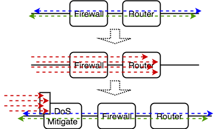
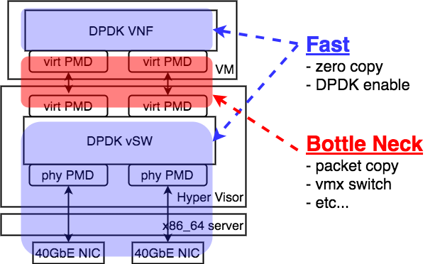
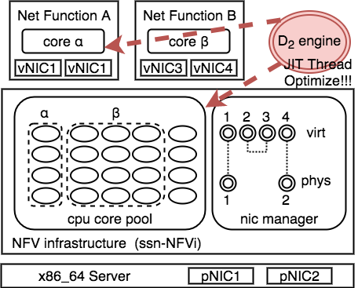
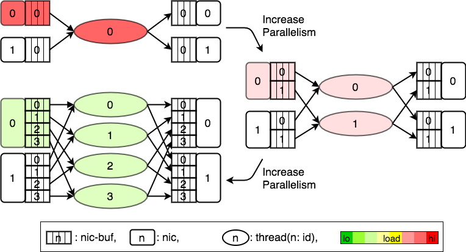
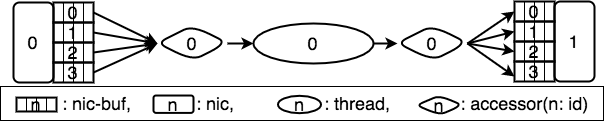
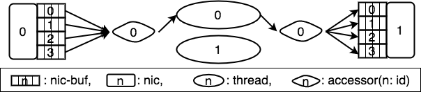
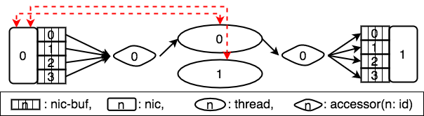
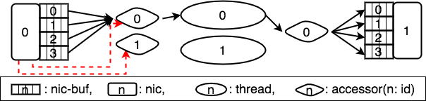
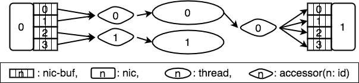
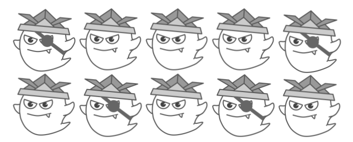

% Susanow:環境に対して自動最適化する高性能通信基盤
% \underline{Hiroki SHIROKURA} @slankdev slank.dev@gmail.com
% powered by IPA-MITOU-program

# Introduction

城倉 弘樹 (SHIROKURA Hiroki) aka slankdev  

- セキュリティキャンプ 2015~
- アルバイト
	- Cybozu-Lab 「拡張可能なパケット解析ライブラリ」
	- Cybozu-Lab 「高性能TCP/IPネットワークスタック」
	- IIJ研究所  「高性能パケット処理」(お休み中)

未踏事業 「環境に対して自動で最適化する高性能通信基盤」

# プロジェクト概要

「汎用サーバを用いた\underline{高性能}で\underline{超動的}なNFVの実現」

[draft.susanow.dpdk.ninja](http://draft.susanow.dpdk.ninja)

- D2(Dynamic Thread Optimizaion) という技術を開発
- D2を用いた動的なNFV基盤開発
- 開発中のNFV基盤上で動くVNF (開発中)
- NFVのいくつか空想を実現

# Background

- SDN/NFVの未来予想図
- DPDKについて

# Network Function Virtialization

- ネットワーク機能を仮想化
- CAPEX/OPEX低減
- 迅速なサービス変形

# Service Function Chaining

- ネットワーク機能を細かく考える
- NFVの迅速性を利用し, 素早いサービス変形を柔軟に
- 現状は様々な方法で実現中(Openflowなど)
- プロトコルとしても標準化中

{width=350}

# 動的なネットワーク変形の例

- DoSを検知したタイミングで新たにNFをデプロイ
- 必要に応じてその場その場でネットワークの機能をつなぎ合わせる
- FW等はルールによっても必要な計算資源の量が違う.
- 最低限のリソースで最大限のパフォーマンス

{width=300}

# DPDKによりIAサーバで高性能通信が可能

- 100Gクラスのトラフィックもパケットフォワード可能
- 現状のボトルネックは経路検索などのアルゴリズム
- 4つの特徴により実現

{width=250}

# DPDK: 課題

- 高い開発コスト: コンピュータ理論に対する精通
- スレッド多重化率などのカリカリチューニング
- VM環境でのオーバヘッド: 仮装NICのメモリコピー

{width=300}

# Background: まとめ

現状とその課題

- NFVによりネットワーク制御はより動的に
- DPDKを用いることで高性能なNFを実装可能
- しかし開発コストがまだ高い
- 特定環境に最適化されている.

提案

- ssn-NFVi: nonVM NFV基盤
- D2: DPDK VNFのスレッドチューニングの自動化
- ssn-NFVi上で動作するしD2で自動最適化を行うVNF (開発中)

# Susanow Architecture

- ssn-NFVi: nonVMなNFVi
	- ポート管理やコアの管理をまとめて行う
	- VNFのデプロイインターフェース
- D2engine: 動的スレッド最適化技術

{width=250}

# D2: Dynamic Thread Optimization

- Dynamic Thread Optimization -> DTO -> D2
- スレッド最適化を動的に行う技術のこと
- D2-APIを用いてVNFを実装することで利用可能
- \underline{VNF単体}を動的に最適化する
- \underline{VNF数}を増やしてサービスを最適化ではない

{width=300}

# D2: Dynamic Thread Optimization

- vSwitchやルータなどのL2/L3-NFから
  アプリケーションデータを扱うDPI Firewallまで幅広く対応可能
- パケットを受け取ったあとの処理はVNF開発者が記述
- D2はその処理を効率的に多重化が可能

# D2: 最適化の流れ

- Thread: 先ほどのプログラムが動く (コアに固定される)
- Accessor: スレッドとポートのアクセスを仲介
- Nic-buf: NICのMultiqueue

# D2: 最適化の流れ

- 新たにスレッドを生成
- 枠内数字はidである

# D2: 最適化の流れ

- ポートとスレッドでネゴシエーション
- ポートに対していくつのスレッドからのアクセスがあるかを確認する

# D2: 最適化の流れ

- ポートにアクセスするスレッドの数に合わせて
  Accessorを再構成

# D2: 最適化の流れ

- Accessorとスレッドを再起動する
- これらの手順でスレッドの多重化を行う

# D2: 最適化の流れ

- 同様の手順で多重化を進めることで性能向上が可能

# D2: まとめ

- 事前にスレッドとポートでネゴシエーションを行い,
  各ポートのAccessorを構成し直す
- HW Queueの再構成はリンクダウンをしないといけないので
  滅多に起こさないようにする. (もちろん可能)
- Accessorが複数のnic-bufを監視している時はラウンドロビンにnic-bufを監視

# D2: 最適化の流れ

1. 発火フェーズ
	- VNFを追加したり減らしたりするタイミング
	- トラフィックが増えたり, 減ったりするタイミング
	- タイマーで一定期間ごとに性能チェック.
2. 発見フェーズ (環境情報より発見)
	- NICのスループット
	- パケット格納用のQueueの統計情報
3. 修正フェーズ
	- スレッドの多重度 (基本的にはこれ)
	- NICのHW設定をチューニング

# Performance Evaluation

- 懸念点
	- D2オーバヘッド: 何nsの処理オーバヘッドか?
	- VMオーバヘッドとどのように: スムーズに進むか?
	- スレッドの起動の速度は?
	- D2最適化中のトラフィックはどれだけどまるか
- 計測内容: 帯域, 遅延
- VNF: L2FWD, L3FWD, ACL, DPI

全て現在調べ中です. 8合目合宿までに!!

# 全体のまとめ

- ssn-NFVi: nonVMなNFV基盤の開発
- D2: 動的スレッド最適化技術の開発
- システムと分離した場所からD2の最適化処理を制御するエージェント
- ssn-NFVi上で動作するVNF複数種類 (VNFリポジトリ)
	- DPI, Router, FW, etc..

# 以降補足スライド

# 今後やる+プラスアルファ内容

- 複数ノードでのクラスタリングの動的な性能変更
	- VNFのマイグレーション機能
- 互換性向上
	- VMを用いたVNFのデプロイの対応
	- 物理ネットワークアプライアンスの対応
- VNFの実装
	- 現在開発中: L2fwd, L3fwd, 5tupleACL, DPI
	- 他にも良いVNF案があれば御指摘ください

