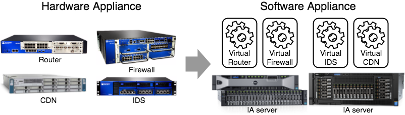
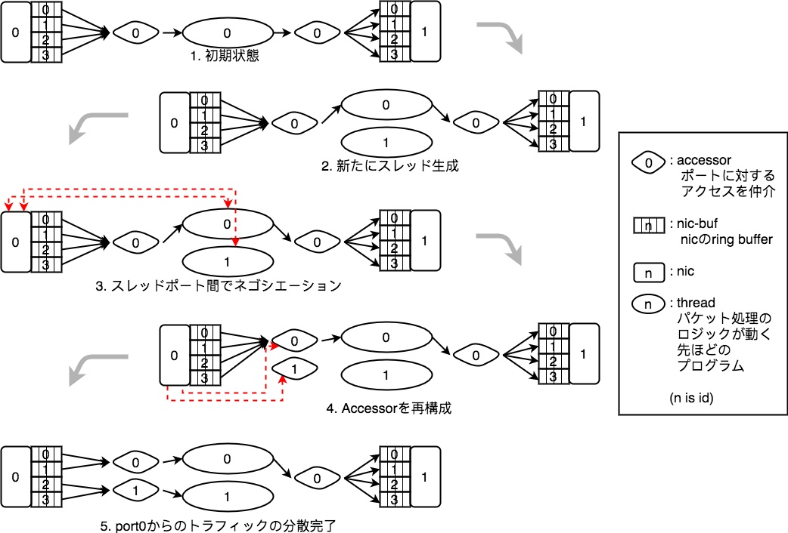

% susanow計画: \newline 環境に対して自動最適化する \newline 高性能通信基盤の開発
% \underline{Hiroki SHIROKURA} @slankdev HoseUniv/IIJii
% powered by IPA-MITOU-program

# Self-introduction

城倉 弘樹 (SHIROKURA Hiroki) aka slankdev  

- 法政大学 理工学部 B4
- 高性能通信, パケット解析, セキュリティ

未踏事業

- 環境に対して自動で最適化する高性能通信基盤
- ルータやFirewallを環境に合わせて自動で最適化する基盤, \newline
  ルータそのもの, 管理するシステム全体
- \textbf{\underline{高性能で動的}}なNFVの実現
- プロジェクト詳細: [http://draft.susanow.dpdk.ninja](http://draft.susanow.dpdk.ninja)

# NFV #とは...

- Network Functions Virtualization (NW機能の仮想化)
- ルータなどNetwork Functions(NF)を \newline
  ソフトウェアで実現Virtial NF(VNF)
- コストダウン: CAPEX(設備費)/OPEX(運用費)低下
- 迅速なサービス展開が可能
	- サービス機能の迅速な変形
	- サービス容量の迅速な拡大/縮小

# NFV: 迅速な変形,拡大/縮小の例

- ルーティングとFWを提供するネットワーク
- DoS対策を行なっていないネットワークだとDoS攻撃によるサービス停止の危険
- DoSを検知したタイミングで新たにVNFをデプロイ
- 変形: 必要に応じてその場その場でNFをつなぎ合わせる
- 拡大: 最低限のリソースで最大限のパフォーマンス
	- FW等はルールによっても必要な計算資源の量が違う.

{width=300}

# NFVのアーキテクチャ

NFVの抽象アーキテクチャ

	- VNFs: Router, FW, DPI, etc...
	- NVFi: 各種リソースを管理する基盤
	- MANO: 全体を管理/連携

{width=250}

# NFV: 実装について

- VNFはDPDKを用いて開発することで高性能に実現可能
- DPDK: Data Plane Development Kit
	- IAサーバ上で高性能通信をするためのフレームワーク
	- 100Gクラスのトラフィックもパケットフォワード可能
	- 4つの特徴により実現

{width=250}

# NFV::DPDK: 高い開発コストと局所性, VMオーバヘッド

- コンピュータ理論に対する精通
- 特定の状況に合わせて最適化された特殊VNFが多い
- VM環境でのオーバヘッド: 仮装NICのメモリコピー

{width=300}

# susanow計画

主要技術

- D2: 動的スレッド最適化技術, MANO <- 後述
- SSN-NFVi: novm-NVFi <- 後述

{width=250}

# D2: Dynamic Thread Optimization

- パケット処理ロジックの多重化を動的に行う技術
- VNFの性能最適化する目的で使用
- パケット処理のロジックはVNF開発者が記述
- D2-APIを用いてVNFを実装することで利用可能
- 適用範囲
	- vSwitchやルータなどのL2/L3-NFから
	  アプリケーションデータを扱うDPIまで幅広く対応可能

# D2: Flow of Optimizing

1. 発火フェーズ
	- VNFを追加したり減らしたりするタイミング
	- トラフィックが増えたり, 減ったりするタイミング
	- タイマーで一定期間ごとに性能チェック.
2. 発見フェーズ (環境情報より発見)
	- NICのスループット
	- パケット格納用のQueueの統計情報
3. 修正フェーズ
	- スレッドの多重度 (基本的にはこれ)
	- NICのHW設定をチューニング

# D2: Flow of Optimizing (修正フェーズ)

# D2: まとめ

- VNFのパケット処理ロジックとその多重化を分離
- 多重に並列化することによりVNF性能を向上
- 任意の並列多重数に最適化可能

{width=300}

# SSN-NFVi

- D2を用いたVNFをデプロイ可能なNFVi
- VNFのカプセルをVMでは行わず, NVFiと同じプロセスで動かす
- 対応機能
	- CPUコアの管理
	- NIC(virt/phys)管理, vNIC-patch-panel

{width=250}

# Performance Evaluation

これから調べる予定. 8合目合宿までに!!

- D2オーバヘッド: 何nsの処理オーバヘッドか?
- D2最適化中のトラフィックはどれだけとまるか

{width=300}

# 全体のまとめ

- ssn-NFVi: nonVMなNFV基盤の開発
- D2: 動的スレッド最適化技術の開発
- [WIP] D2の最適化処理を制御するエージェント
- [WIP] ssn-NFVi上で動作するVNF複数種類 (VNFリポジトリ)
	- DPI, Router, FW, etc..
- より動的で高性能なNFVの実現

# 以降補足スライド

# 今後やる+プラスアルファ内容

- インターフェースの改善:
	- VNFのデプロイインターフェースの改善
- 性能向上: オーバヘッド部分を改善
- 複数NFViクラスタ対応: VNFのマイグレーション
- 互換性向上
	- VMを用いたVNFのデプロイの対応 (すぐできる)
	- 物理ネットワークアプライアンスの対応 (すぐできる)
- VNFの実装
	- 現在開発中: L2fwd, L3fwd, 5tupleACL, \underline{DPI}
	- 他にもVNF案があれば御意見ください

